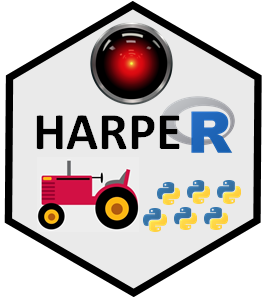
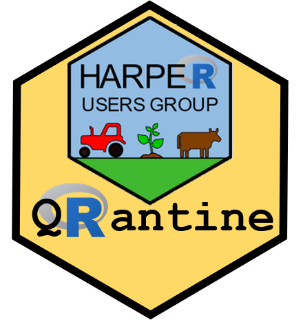

   
   
   
   

&nbsp;

**This page is devoted to our R programming, Python, Statistics and Data Science groups at Harper Adams University.  Have a look at our resources and schedule of meetings below.**

&nbsp;

<head>
    
</head>

 
<table>
    <tr>
        <th></th>
        <th></th>
    </tr>
    <tr>
        <th><a href="pages/harug.html">HARUG!</a></th>
        <th><a href="pages/hap-e.html">HAP-E Group</a></th>
    </tr>
    <tr>
        <td>Harper Adams R Users Group!</td>
        <td>Harper Adams Python Enthusiasts Group</td>
    </tr>
</table>

