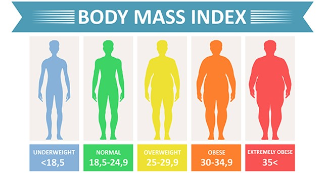

# C7081 lab 01 Data warm-up

&nbsp;

## Guidance for labs

Material for C7081 labs follows the spirit and select content of:

[James, G., Witten, D., Hastie, T., Tibshirani, R., 2021. An Introduction to Statistical Learning: with Applications in R, Springer Texts in Statistics 2ed. Springer-Verlag, New York.](https://www.statlearning.com/)

&nbsp;

### Recommendations

- Use a formal, reproducible R script to solve each lab

- Fully comment you scripts with Header, Contents and section blocks

- Start with a simple [template script](files/script-template.R)

- Type 100% of your own code and do not copy and paste any code

- Consider writing your labs using Markdown or R Markdown scripts

- Consider setting up a Github repository for your lab scripts

&nbsp;

## Activity 01 BMI Tidy Data 

(~15 min with scrutiny and discussion)

&nbsp;

&nbsp;

This activity uses BMI (Body Mass Index) data to exercise a few elements of best practice in data science, starting with the [Tidy Data concept](https://dsgarage.netlify.app/bootcamp/1.4-m1-data-frames/).  The activity consists of the following steps:

Start by downloadiong and examining 2 tab delimited data files [bmi_f.txt](data/bmi_f.txt), [bmi_m.txt](data/bmi_m.txt) (tab delimited text files)

The data fields:

- 'ID', subject ID within each file

- 'steps', # steps / wk past 16 weeks

- 'bmi', bmi measure

- Also, each file corresponds to a different 'sex' (obviously)

&nbsp;

Tasks:

- Convert the data into Tidy Data format in a single .xlsx file (4 data columns)

- Simple variable names

- Data dictionary

- Name new file 'bmi_male_and_female.xlsx'

&nbsp;

## Activity 02 BMI analysis

(~30 min analysis + additional time for discussion)

&nbsp;

This activity is an opportunity to examine a dataset with minimal instruction, a very common task for data scientists.  We will document the analysis in a reproducible format using best practice. The point here is to learn from the data, rather than practicing code or scripting (but, there is of course overlap between these).

&nbsp;

Tasks:

- Receive individual instructions by email

- Plain reproducible R script (template)

- Perform analysis ~30 mins

- Do not discuss instructions with others

- Discussion of findings

&nbsp;

## Activity 03 BMI data Markdown report

(~45 min make your own report)

&nbsp;

The task here is to convert your tidy data analysis of the BMI data to a [Markdown or R Markdown](https://dsgarage.netlify.app/bootcamp/3.2-m3-rmarkdown/) format with HTML output in the form of a report to be consumed by non- data science folk.

&nbsp;

Tasks:

- Start a new R Markdown file in RStudio > 'document' > 'HTML' (demonstration if needed)

- Sections typically include *Title*, *Summary*, *Background*, *Results*, *Bibliography*

- Some code chunks running R code are typically 'unseen'

- Perform analysis ~30 mins

- Do not discuss instructions with others

- Discussion of findings

&nbsp;

&nbsp;

&nbsp;
