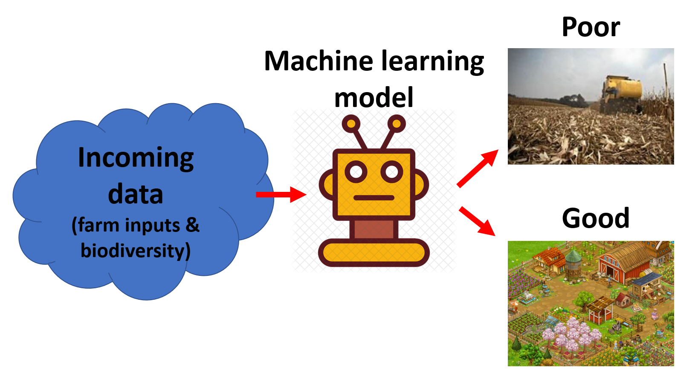
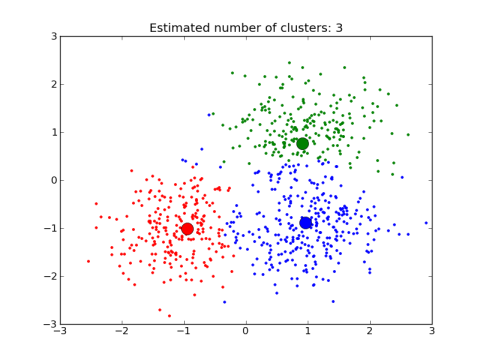
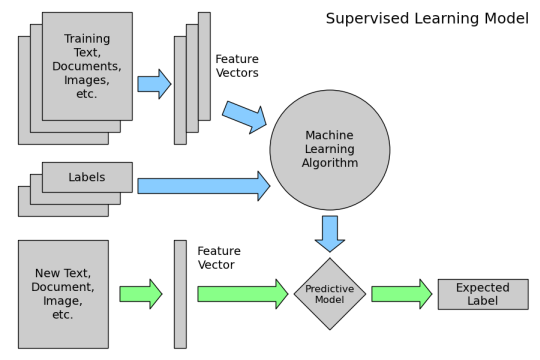

```{r setup, include=FALSE}
knitr::opts_chunk$set(echo = FALSE)
```

## The concept of machine learning

&nbsp;

<center>

> We hear a lot about "machine learning"

> How does it work?

```{r, echo=FALSE, out.width="50%", fig.cap=""}
knitr::include_graphics("img/01_robot.png")
```

</center>

## What you will learn

&nbsp;

- What is Machine Learning?
- What are the main categories of Machine Learning?
- What are some examples of Machine Learning?
- How does Machine Learning "work"?


## What is Machine Learning?

&nbsp;

>One definition: "Machine Learning is the semi-automated extraction of knowledge from data"

- **Knowledge from data**: Starts with a question that might be answerable using data
- **Automated extraction**: A computer provides the insight
- **Semi-automated**: Requires many smart decisions by a human

## What are the main categories of Machine Learning?

&nbsp;

**Supervised learning**: Making predictions using data

**Unsupervised learning**: Extracting structure from data

## Example of supervised learning - farm practice

<center>

```{r, echo=F, out.width="75%", fig.cap="Supervised: we know the categories"}

```

</center>

## Example of unsupervised learning - what farm types are there?

<center>

```{r, echo=F, out.width="60%", fig.cap="Unsupervised: We don't know the categories"}

```

</center>

##  How does Machine Learning "work"?

&nbsp;

High-level steps of supervised learning:

1. First, train a **Machine Learning model** using **labeled data**

    - "Labeled data" has been labeled with the outcome
    - "Machine Learning model" learns the relationship between the attributes of the data and its outcome

2. Then, make **predictions** on **new data** for which the label is unknown

## How does Machine Learning "work"?

<center>

```{r, echo=F, out.width="80%", fig.cap="ML structure and terminology"}

```

</center>

## How does Machine Learning "work"?

&nbsp;

The primary goal of supervised learning is to build a model that "generalizes"

The goal is to accurately predict the **future** rather than the **past**!

## Questions about Machine Learning

&nbsp;

- How do I choose **which attributes** of my data to include in the model?
- How do I choose **which model** to use?
- How do I **optimize** this model for best performance?
- How do I ensure that I'm building a model that will **generalize** to unseen data?
- Can I **estimate** how well my model is likely to perform on unseen data?

## Resources

- Book: [An Introduction to Statistical Learning](https://www.statlearning.com/) (section 2.1, 14 pages)
- Video: [Learning Paradigms](http://work.caltech.edu/library/014.html) (13 minutes)

## Live coding

&nbsp;

<center>

```{r, echo=FALSE, out.width="60%", fig.cap=""}
knitr::include_graphics("img/cat-laptop.jfif")
```

</center>

