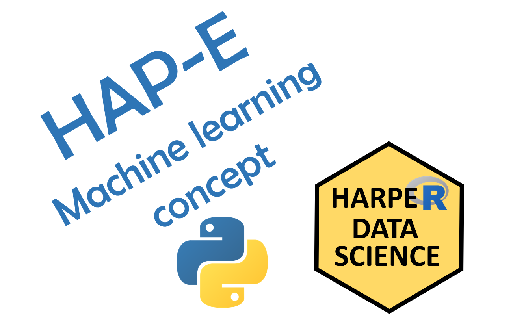
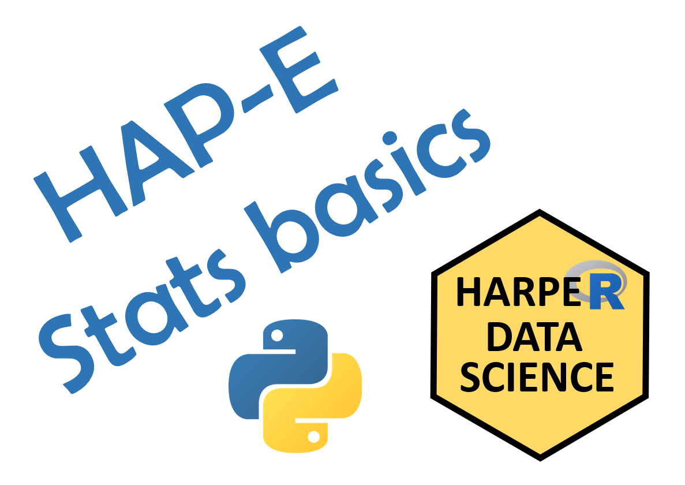
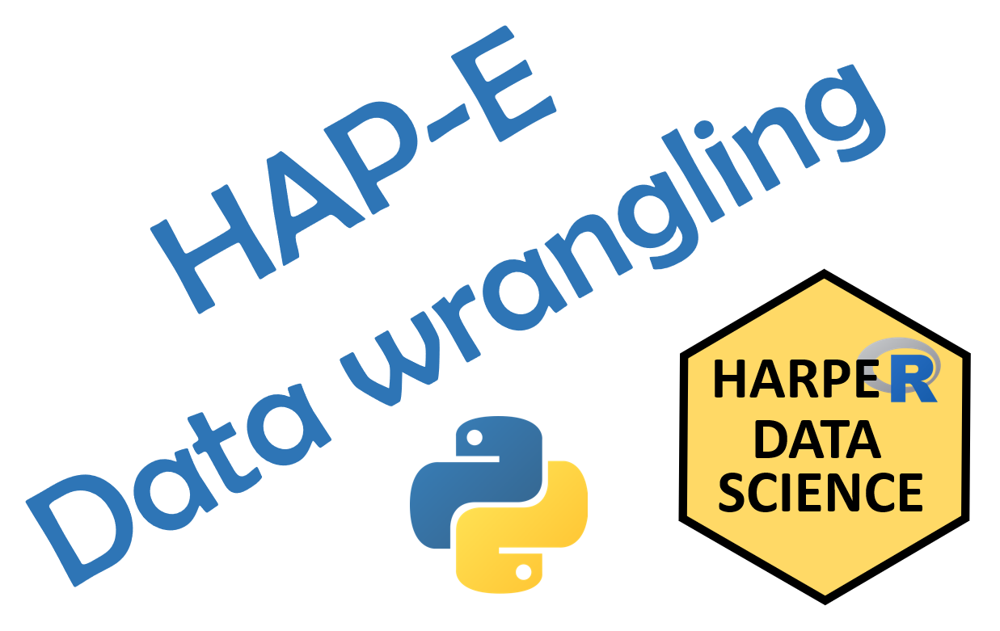
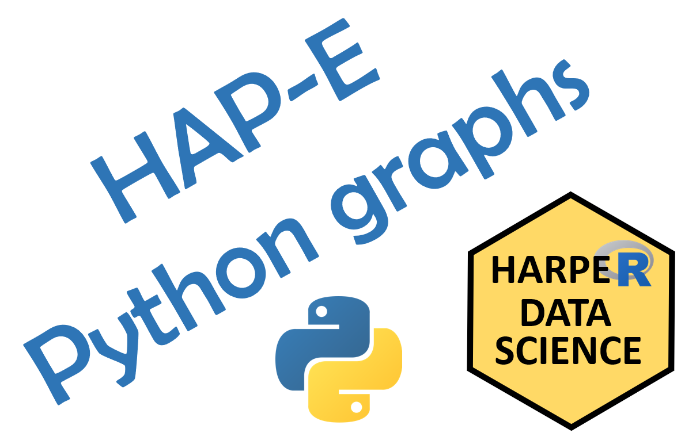
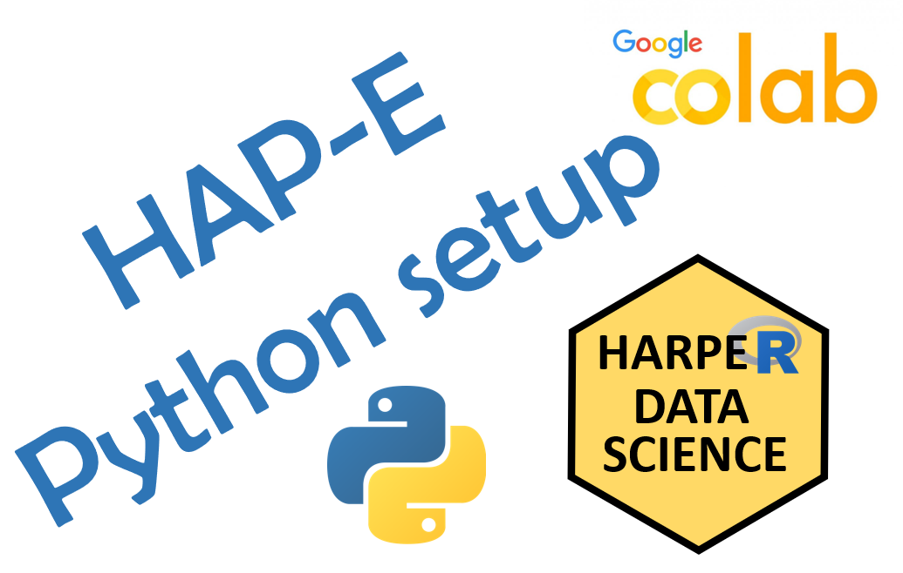

   

&nbsp;

**HAP-E Group is a Python and data science group based at Harper Adams University.** We are a friendly group and welcome members from beginners to experts.  Our topics cover Python programming and the practice of statistics, and data science, computer vision and related topics, spanning from skill building to live coding and problem solving, with occasional advanced topics or readings.

[HA Data Science main page](https://ha-data-science.github.io/)

&nbsp;

**Weekly live meetings Friday at 1pm (online for now)**

[**Join us on Slack**](https://join.slack.com/t/harper-adams-rug/shared_invite/zt-azcm9z6s-WsY9JXvAs8DW1DLQuU3USg) (kindly register with your real name, e.g. "Ada Lovelace" or "Alan Turing")

&nbsp;

___

**2021-09-09** (meeting #7) Python Bootcamp #1 (Ed Harris)

&nbsp;

 

**2021-08-13** (meeting #6) Machine learning concept (Ed Harris) ::
Colab tutorial =   ::
[HAP-E ML concept slides Rmd](hap-e-files\2021-08-13/HAP-E-ml-intro-slides.Rmd) ::
[HAP-E ML concept slides HTML](hap-e-files\2021-08-13/HAP-E-ml-intro-slides.html) ::
[advertising data csv](https://github.com/ha-data-science/ha-data-science.github.io/blob/main/pages/hap-e-files/2021-08-13/data/Advertising.csv)

&nbsp;

 

  Oops, no video this week  

**2021-08-06** (meeting #5) Stats framework in Python (Ed Harris) ::
Colab tutorial =   ::
[potato data xlsx](hap-e-files/2021-08-06/potatoes.xlsx) 

&nbsp;

 

**2021-07-30** (meeting #4) Topic TBA (George Wager) ::
Colab tutorial =   ::
[Tidy data R script](hap-e-files/2021-07-30/studentperformancecomparisonscript.R) ::
[Tidy data example data csv](hap-e-files/2021-07-30/studentperformance.csv)

&nbsp;

 

**2021-07-23** (meeting #3) Graphing in Python (Joe Roberts) ::
Colab tutorial =  

&nbsp;

 

**2021-07-16** (meeting #2) Handling files in Python (Joe Mhango) ::
Colab tutorial =  
  
&nbsp;

 

**2021-07-09** (meeting #1) HAP-E Group Launch and Google Colab (Ed Harris) ::
[HAP-E group launch slides ppt](hap-e-files/2021-07-09/2021-07-09 HAP-E launch.pptx) ::
Colab tutorial =  
 
___

 
&nbsp;
