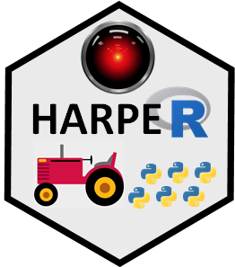

   

&nbsp;

**HAP-E Group is a Python and data science group based at Harper Adams University.** We are a friendly group and welcome members from beginners to experts.  Our topics cover Python programming and the practice of statistics, and data science, computer vision and related topics, spanning from skill building to live coding and problem solving, with occasional advanced topics or readings.

&nbsp;

**Weekly live meetings Friday at 1pm (online for now)**

[**Join us on Slack**](https://join.slack.com/t/harper-adams-rug/shared_invite/zt-azcm9z6s-WsY9JXvAs8DW1DLQuU3USg) (kindly register with your real name, e.g. "Alan Turing")

&nbsp;

**2021-07-09** HAP-E Group Launch and Google Colab ::
[ppt](hap-e-files/2021-07-09/2021-07-09 HAP-E launch.pptx) :: 
https://colab.research.google.com/github/ha-data-science/ha-data-science.github.io/blob/main/pages/hap-e-files/2021-07-09/HAP-E-colab-tutorial.ipynb
 
&nbsp;

