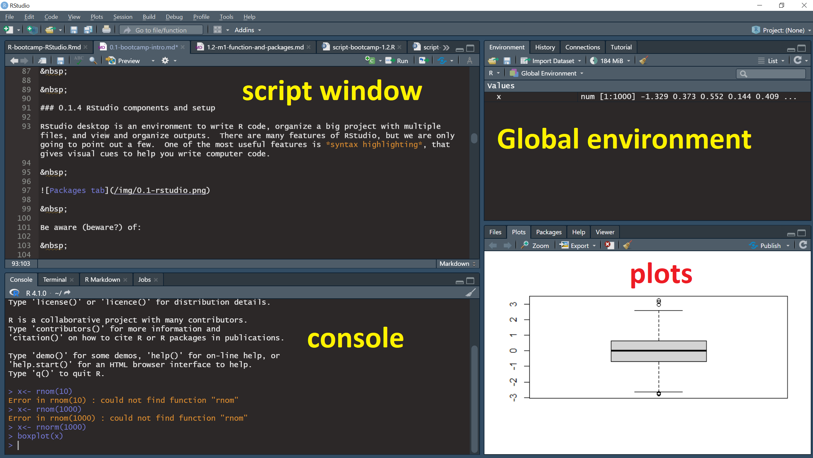

```{r setup, include=FALSE}
knitr::opts_chunk$set(echo = FALSE)
```

## Day 1 with R and Rstudio

&nbsp;

https://dsgarage.netlify.app/bootcamp/0.1-bootcamp-intro/

```{r, echo=FALSE, out.width="40%", fig.cap=""}
knitr::include_graphics("img/day1.png")
```


## What will you learn?

&nbsp;

- Install R and RStudio

- Read the pages and type and run all code

- Practice good, **reproducible** scripting


## Tour of RStudio interface

https://dsgarage.netlify.app/bootcamp/0.1-bootcamp-intro/#anchor-4

```{r, echo=FALSE, out.width="80%", fig.cap=""}

```

## Reproducible script

https://dsgarage.netlify.app/bootcamp/0.1-bootcamp-intro/#anchor-5

```{r, echo=FALSE, out.width="80%", fig.cap=""}

```

