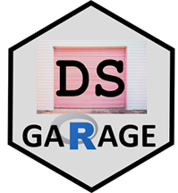
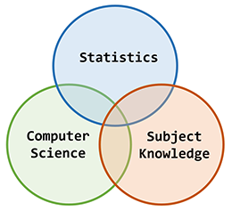
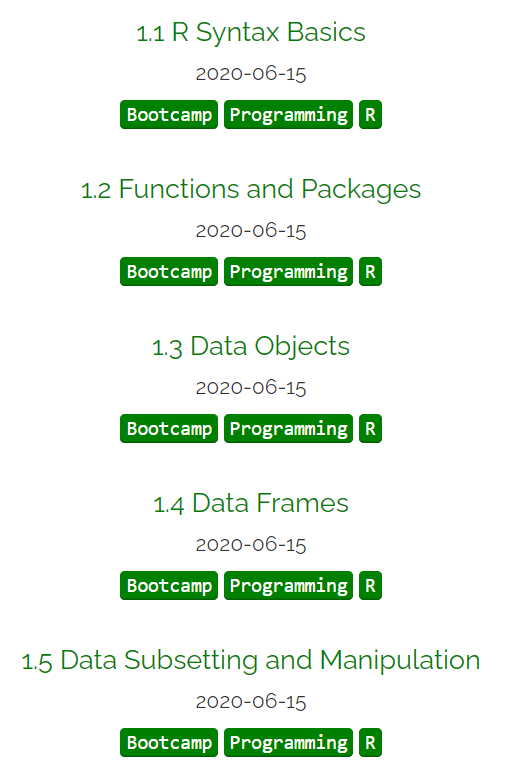
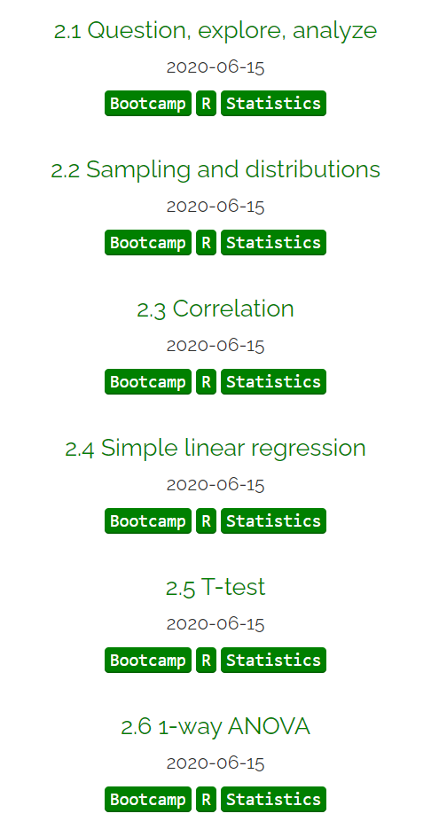
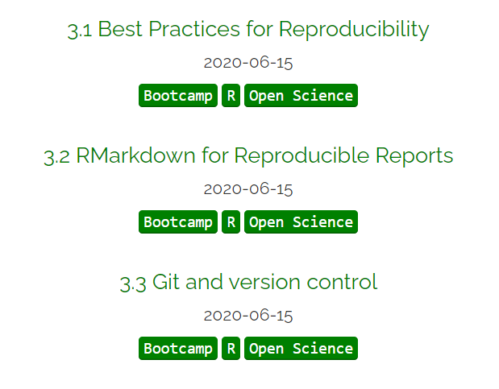

```{r setup, include=FALSE}
knitr::opts_chunk$set(echo = FALSE)
```

## Data science garage

&nbsp;

https://dsgarage.netlify.app/

```{r, echo=FALSE, out.width="30%", fig.cap=""}

```


## What is DS garage about?

&nbsp;

Modern tools for thinking about data :: evidence

```{r, echo=FALSE, out.width="40%", fig.cap=""}

```

## Traditional Bootcamp

&nbsp;

```{r, echo=FALSE, out.width="40%", fig.cap=""}

```

difficult, unfriendly, **intense**


## Ed's R Bootcamp

&nbsp;

```{r, echo=FALSE, out.width="20%", fig.cap=""}

```


## Why R bootcamp?

&nbsp;

<center>
The purpose of the bootcamp is to be a **SELF-GUIDED resource** to learn basic **R programming** and basic **statistics** assuming **no prior knowledge**
</center>

## Who is it for?

&nbsp;

- Any students who want to learn from data

- Academic colleagues who want to learn R

- Learning data scientists 

- Other interesting people


## What will you learn?

&nbsp;

- Intro R programming language

- Best practice for reproducible scripts

- Tidy data

- Review of simple statistics (just enough...)


## How is it organised? https://dsgarage.netlify.app/bootcamp/


&nbsp;

**Module 1** (pages 1.x): A bare-bones introduction to **R and Rstudio for beginners**

**Module 2** (pages 2.x): A bare-bones introduction to **using R for traditional data analysis**

**Module 3** (pages 3.x): An introduction to **reproducible code, R Markdown, and Github**


## How is it organised? https://dsgarage.netlify.app/bootcamp/

**Module 1**

```{r, echo=FALSE, out.width="35%", fig.cap=""}

```

## How is it organised? https://dsgarage.netlify.app/bootcamp/

**Module 2**

```{r, echo=FALSE, out.width="25%", fig.cap=""}

```

## How is it organised? https://dsgarage.netlify.app/bootcamp/

**Module 3**

```{r, echo=FALSE, out.width="35%", fig.cap=""}

```

## Live coding demos

```{r, echo=FALSE, out.width="60%", fig.cap=""}
knitr::include_graphics("img/cat-laptop.jfif")
```

