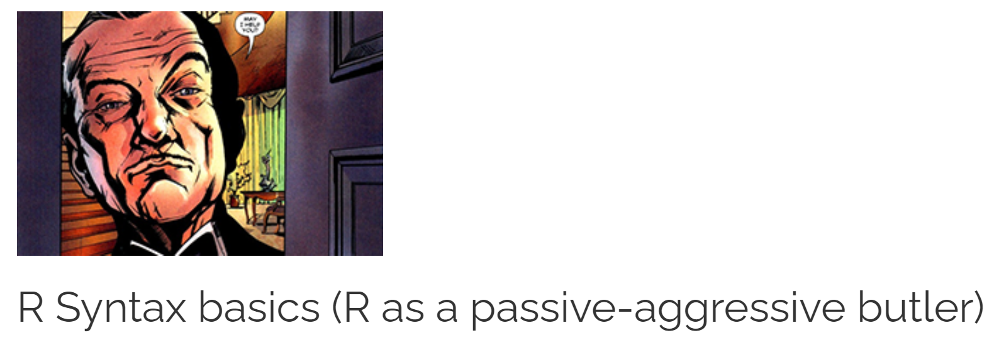
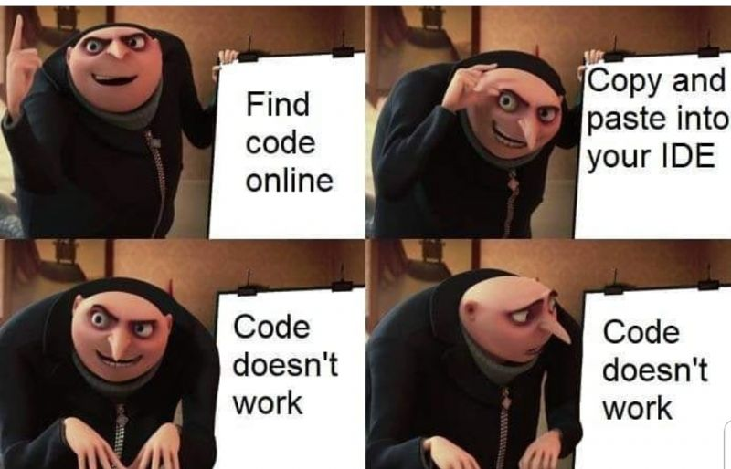

```{r setup, include=FALSE}
knitr::opts_chunk$set(echo = FALSE)
```

## R Syntax

&nbsp;

```{r, echo=FALSE, out.width="100%", fig.cap=""}

```


## What you will learn

&nbsp;

- Setting up a script: best practice
- Math operators
- Logical (Boolean) operators
- a note about **base R** versus **Tidyverse**
- Practice exercises

## Using the Bootcamp

&nbsp;

> To get the most out of the Bootcamp, I strongly recommend that you work through the instructions here while using R and RStudio as you go along. 

```{r, echo=FALSE, out.width="40%", fig.cap=""}

```

## First script

&nbsp;

```{r script, echo=T}
## HEADER ####
## Who: <YOUR NAME>
## https://dsgarage.netlify.app/
## What: 1.1 R syntax basics
## Last edited: <DATE TODAY in yyyy-mm-dd format)
####


## CONTENTS ####
## 1.1.1 Example script, help, pseudocode  
## 1.1.2 Math operators  
## 1.1.3 Logical Boolean operators  
## 1.1.4 Regarding base R and the Tidyverse   
## 1.1.5 Practice exercises  

```

## Type it yourself

&nbsp;

```{r, echo=FALSE, out.width="80%", fig.cap=""}

```

## Activity for everyone

&nbsp;

Each Bootcamp page has **Exercises**

One question is always to **write your own new question**

Time at the end for people to **share questions they have written**

I try to **categorize them** *Easy*, *Medium*, *Hard*

Also, **relevant to page content**!