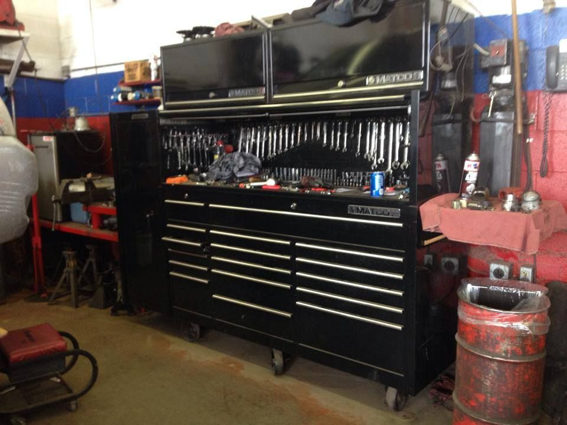
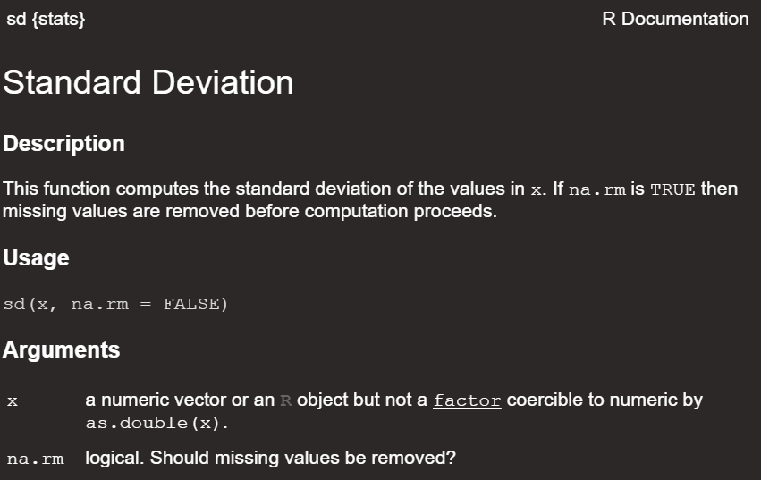

```{r setup, include=FALSE}
knitr::opts_chunk$set(echo = FALSE)
```

## R as a garage

&nbsp;

<center>

A garage has toolboxes and tools

```{r, echo=FALSE, out.width="60%", fig.cap=""}

```

</center>

## What you will learn

&nbsp;

- Function tour
- Using functions and getting help
- R "Packages"
- Finding, downloading and using packages


## Function tour

&nbsp;

**Functions are tools** that do work

The structure of an R function:

&nbsp;

function_name(<br>
argument_1 = value_1,<br>
argument_2 = value_2,<br>
...<br>
)

##  Using functions and getting help

&nbsp;

<center>

help(topic = <function name>), e.g. `help(topic = sd)`

```{r, echo=F, out.width="75%", fig.cap=""}

```

</center>

##  R "Packages"

&nbsp;

<center>

> Someone has probably created a tool (function) to solve your problem.  

> You just have to find the toolbox (R package) it is in.

```{r, echo=FALSE, out.width="50%", fig.cap=""}

```

</center>


## Finding, downloading and using packages

<center>

Finding packages happens a variety of ways in practice. A package may be recommended to you, you might be told to use a particular package for a task or assignment, or you may discover it on the web.

</center>

&nbsp;

`install.packages("package_name")`
`library("package_name")`

```{r, echo=FALSE, out.width="60%", fig.cap=""}
# knitr::include_graphics("img/copy-paste.jpg")
```

## Live coding

&nbsp;

<center>

```{r, echo=FALSE, out.width="60%", fig.cap=""}
knitr::include_graphics("img/cat-laptop.jfif")
```

</center>