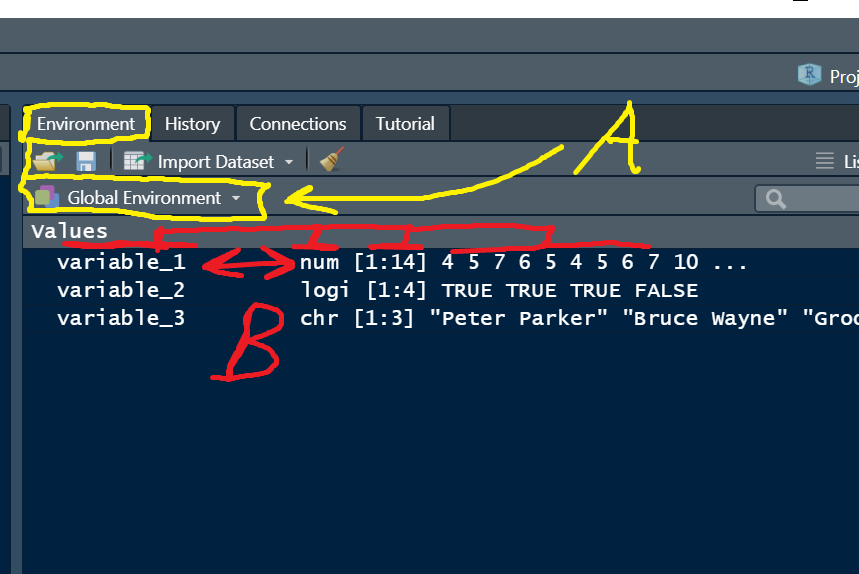

```{r setup, include=FALSE}
knitr::opts_chunk$set(echo = FALSE)
```

## R Space

&nbsp;

https://dsgarage.netlify.app/bootcamp/1.3-m1-data-objects/

```{r, echo=FALSE, out.width="40%", fig.cap=""}
knitr::include_graphics("img/r-space.png")
```


## What you will learn

&nbsp;

- Basic data types in R, str()
- Data with factors
- class() and converting variables
- Vector and matrix fun


## Basic data types in R, str()

&nbsp;

**Data objects** are **storage containers**

&nbsp;

```r
x <- 1 # single numeric integer

y <- c(4.43, 2.70) # vector of numeric decimal values

z <- c("Bob", "Karen") # vector of character strings
```

##  The Global environment "R space"

&nbsp;


```{r, echo=F, out.width="60%", fig.cap=""}

```


##  The Global environment "R space"

&nbsp;


```{r, echo=F, out.width="70%", fig.cap=""}

```


##  Variable name conventions

&nbsp;

- Can contain letters, numbers, some symbolic characters

- Must begin with a letter

- Must not contain spaces

- No forbidden characters like '+', '-', '@', and others

- Should be human-readable, consistent, and not too long

- Case sensitive


## Factors

&nbsp;

**A factor is data where the different values are categories**

- Ordered factor

`'Monday', 'Tuesday', 'Wednesday...'`

- Non-ordered factor

`"Staffordshire", "Lancashire"...`

&nbsp;

Generally need to think about this when analysing data

## class() and converting variables

&nbsp;

- The `class()` function can be use to see what R thinks your variable class is

- Also, the Global Environment


```{r, echo=FALSE, out.width="90%", fig.cap=""}

```

## Vectors and matrices

&nbsp;

**Vector** 

- stores data in a single dimension from 1 to i, my_vec[i]

**Matrix** 

- stores data in two dimensions 1 to i rows, 1 to j columns my_mat[i, j]

**Array**

- 3 dimensions to i, j, and k my_array[i, j, k]

## Live coding demo

```{r, echo=FALSE, out.width="60%", fig.cap=""}
knitr::include_graphics("img/cat-laptop.jfif")
```

