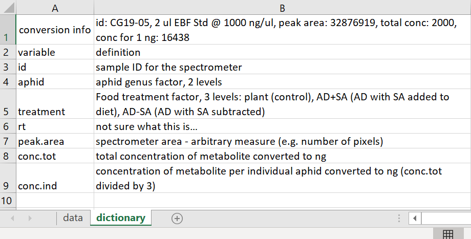

```{r setup, include=FALSE}
knitr::opts_chunk$set(echo = FALSE)
```

## R Space

&nbsp;

<center>

> Data should be tidy with *mis en place*

```{r, echo=FALSE, out.width="35%", fig.cap=""}

```

</center>

## What you will learn

&nbsp;

- "Tidy Data" concept
- Common data file types
- Excel, data setup, and the Data Dictionary
- Getting data into R
- Manipulating variables
- Practice exercises


## "Tidy Data" concept

&nbsp;

<center>

```{r, echo=FALSE, out.width="80%", fig.cap=""}

```

</center>

## "Tidy Data" concept

&nbsp;

The data should be in a standard, accessible, reproducible, non-haphazard, format

- One column per variable

- One row per observational unit

- Thought given to sympathetic data "codification"

- explanation of variables

- Variable naming conventions


## Common data file types

&nbsp;

**Delimited text files**

- .csv, .txt, tab-delimited, others

- first row with variable names

- problem with explanation of variables

&nbsp;

**Excel is okay**, but must be **Tidy**

**Avoid proprietary formats** (like SPSS, Genstat, etc.)


##  Data formats

<center>

```{r, echo=F, out.width="80%", fig.cap="Untidy data in Excel"}
knitr::include_graphics("img/1.4-untidy.png")
```

</center>


##  Data formats

<center>

```{r, echo=F, out.width="80%", fig.cap="Tidy data in Excel"}
knitr::include_graphics("img/1.4-tidy.png")
```

</center>


##  Data formats

<center>

```{r, echo=F, out.width="80%", fig.cap="Data dictionary"}

```

</center>


##  Data formats

<center>

```{r, echo=F, out.width="50%", fig.cap="Tidy csv"}

```

</center>


##  Getting data into R

&nbsp;

<center>

Step 1 Set your working directory with code, or RStudio menus

```{r, echo=F, out.width="70%", fig.cap="Working directory menus"}

```

</center>


##  Getting data into R

&nbsp;

Different data file types require different functions

&nbsp;

for .csv `read.csv()`

for other delimited `read.table()`

for Excel `library(openxlsx); read.xlsx()`

many others exist


## Manipulating variables

&nbsp;

- `names()` function

- The use of the `$` operator for data frames

- The use of the `str()` function for data frames

- The use of the index operator `[ , ]`

- The use of the `attach()` function


## Live coding

&nbsp;

<center>

```{r, echo=FALSE, out.width="60%", fig.cap=""}
knitr::include_graphics("img/cat-laptop.jfif")
```

</center>

