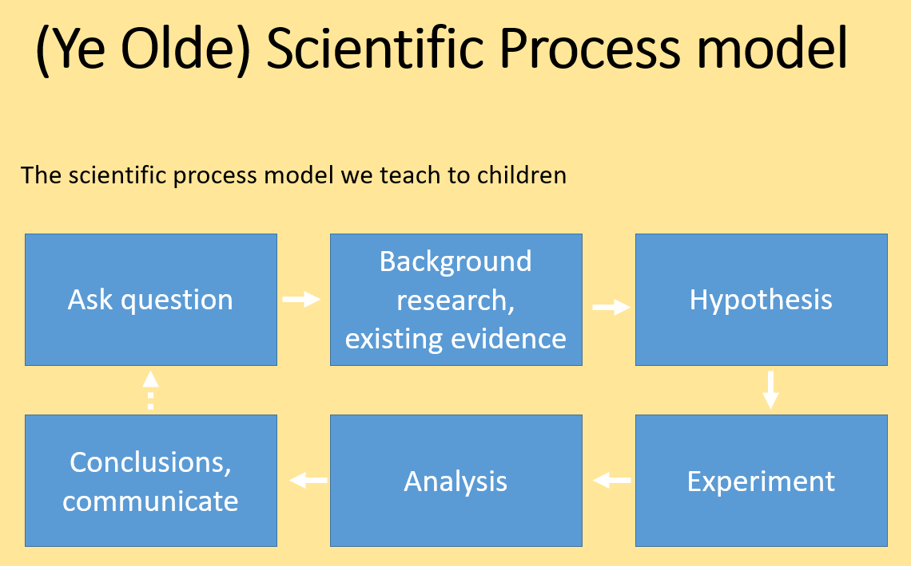
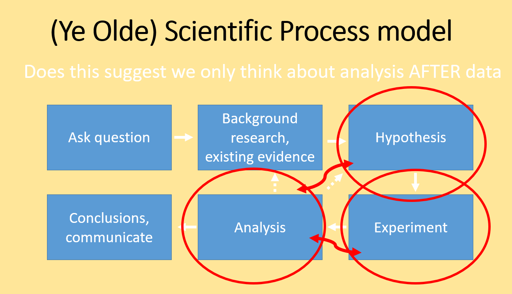
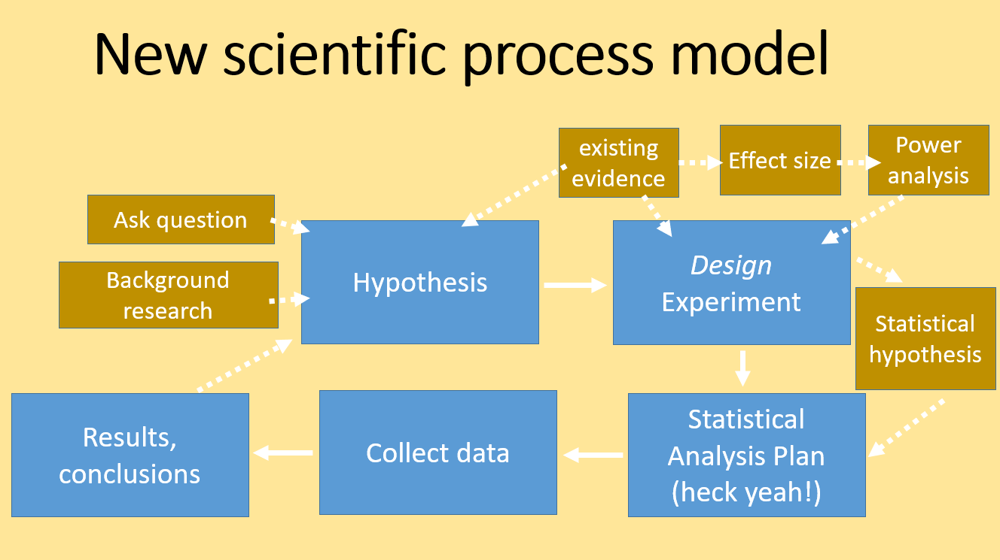

```{r setup, include=FALSE}
knitr::opts_chunk$set(echo = FALSE)
```

## Summarizing data

&nbsp;

<center>

> The first thing you do with a big "pig" of a data set?

> Weigh the pig.

```{r, echo=FALSE, out.width="30%", fig.cap=""}
knitr::include_graphics("img/unsplash-pig.png")
```

</center>

## What you will learn

&nbsp;

- Null Hypothesis Testing concept
- Using `summary()` to describe data
- Exploratory graphs & data
- Exploratory Data Analysis (EDA) concept
- Statistical analysis plan
- Practice exercises


## Null Hypothesis Testing concept

&nbsp;

> Null Hypothesis Testing: Kind of a big deal

- Start with a question (hypothesis)
- Translate into a *statistical* hypothesis
- (regular hypothesis != statistical hypothesis)
- Design data collection to represent *The Population* of interest 
- Use objective test


## Null Hypothesis Testing concept

&nbsp;

Your question (hypothesis) is stated in plain language

E.g. The number of pollinator species is greater in hedgerows when pesticides are not used nearby

Note this is phrased as a *CLAIM*

## Null Hypothesis Testing concept

&nbsp;

Your statistical hypothesis is formal and philosophical
(and is typically not explicitly stated)

There are 2 parts

**Null Hypothesis** (technically the one you test): 
The mean species count of pollinators IS NOT different

**Alternative Hypothesis**:
The mean species count of pollinators IS different

## Null Hypothesis Testing concept

&nbsp;

The statistical hypothesis is framed using a SPECIFIC statistical test

We say we "test the null hypothesis" by computing a p-value

The P-value is the probability we are wrong (an error) if we reject the Null

We compare the p-value to the maximum risk of this error (usually 0.05)

## Using `summary()` 

Chick weights data

```{r include = F}
library(openxlsx)
```

```{r, echo = T}
chicks <- read.xlsx('data/2.1-chickwts.xlsx')
head(chicks)

```


## Using `summary()` 

Chick weights data

```{r, echo = T}
str(chicks)
```

## Using `summary()` 

Summarize the whole data object

- Just a way to peek at the data
- Summarizing subsets may be desirable

```{r, echo = T}
summary(chicks)
```

## Using `summary()` 

Subsetting and slicing


```{r, echo = T}
summary(object = chicks$weight[which(chicks$feed == "casein")])
summary(object = chicks$weight[which(chicks$feed == "horsebean")])
```

## Using `summary()` 

Do not forget `aggregate()`


```{r, echo = T}
aggregate(x = chicks$weight, by = list(feed = chicks$feed), 
          FUN = function(x){ c(mean = mean(x), 
                               sd = sd(x),  
                               SEM = sd(x)/sqrt(length(x)))})
```

## Using `summary()` 

&nbsp;

- `summary()` can be useful
- Explore and understand variable type and tendency
- Used for "knowing your data"
- Looking for unusual values and errors
- None of this is mandatory, but can be useful
- Take care to keep a tidy script...

## Exploratory graphs & data

&nbsp;

There are a few classic graph types we always use

- Histogram `hist()`: distribution of numeric var
- Box plot `boxplot()`: central tendency of numeric ~ factor
- Scatterplot `plot()`: y ~ x of 2 numeric vars

## Exploratory graphs & data

Histogram `hist()`: distribution of numeric var

```{r, echo = T, fig.height = 3.5, fig.width = 4, fig.align= 'center'}
hist(chicks$weight)
abline(v = mean(chicks$weight), 
       col = 'red', lty = 2, lwd = 2) # vanity
```

## Exploratory graphs & data

Box plot `boxplot()`: central tendency of numeric ~ factor


```{r, echo = T, fig.height = 3.5, fig.width = 4, fig.align= 'center'}
select <- which(chicks$feed=='meatmeal' | chicks$feed=='horsebean')
boxplot(weight ~ feed, data = chicks[select, ], 
        xlab='Weight (g)', ylab = 'Feed')
```


## Exploratory graphs & data

Scatterplot `plot()`: y ~ x of 2 numeric vars

```{r, echo = T, fig.height = 3.5, fig.width = 4, fig.align= 'center'}
x <- rnorm(10); y <- rnorm(10)
plot(y ~ x,
     col = 'red', pch = 16) # vanity
```


## (EDA) Exploratory Data Analysis

EDA:

- Begins every analysis in some form
- Informal, may be haphazard
- Testing assumptions (e.g. distributions)
- Information for the analyst, not others
- May or may not require reproducibility
- Prior to "formal analysis"

## (EDA) Exploratory Data Analysis

Formal analysis

- Designed to generate EVIDENCE for CLAIMS 
- Strictly reproducible
- Generate INFORMATION for others
- Information for the analyst, not others
- Usually contains graphical and statistical components

##  Statistical analysis plan

Best practice:

- **Hypothesis**, objective, claim
- **Specify statistical model**
- **Data collection methods**, sampling 
- Identify **effect size**
- **Justify sample size**

##  Statistical analysis plan

```{r, echo=F, out.width="90%", fig.cap="", fig.align= 'center'}

```


##  Statistical analysis plan

```{r, echo=F, out.width="90%", fig.cap="", fig.align= 'center'}

```


##  Statistical analysis plan

```{r, echo=F, out.width="90%", fig.cap="", fig.align= 'center'}

```


## Live coding

&nbsp;

<center>

```{r, echo=FALSE, out.width="60%", fig.cap=""}
knitr::include_graphics("img/cat-laptop.jfif")
```

</center>

