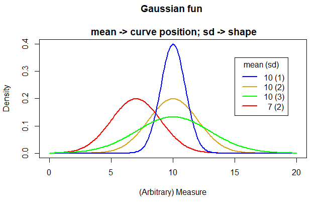
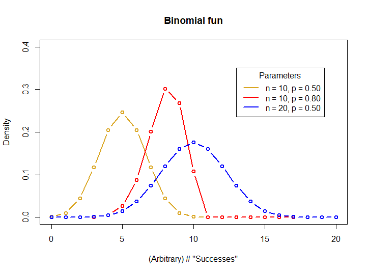
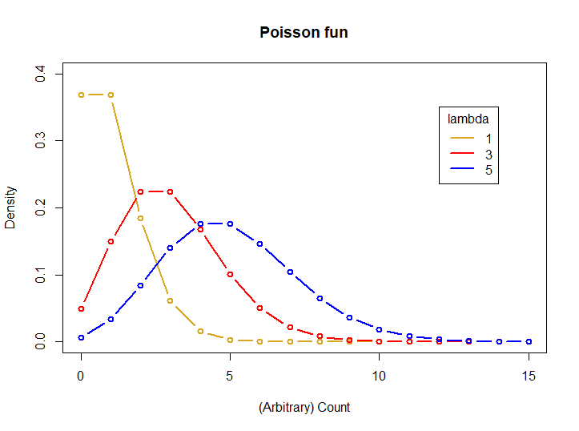

```{r setup, include=FALSE}
knitr::opts_chunk$set(echo = FALSE)
```

## Sampling and distributions


> A curve has been found representing the frequency distribution of standard deviations of samples drawn from a normal population.

-Gosset. 1908, Biometrika 6:25.

<center>

```{r, echo=FALSE, out.width="50%", fig.cap=""}

```

</center>

## What you will learn

&nbsp;

-   Use of the histogram
-   Gaussian ain't normal
-   Poisson
-   Binomial
-   Diagnosing the distribution
-   Practice exercises

## Use of the histogram


```{r, echo = T}
# Let's simulate some fake weight data for 10,000 cats
set.seed(42)
cats <- rnorm(n = 10000, mean = 4, sd = 0.5)
```

<center>
```{r, fig.width=5, fig.height=4, warning=FALSE}
hist(cats, xlab = "Cat weight (Kg)")
```
</center>

## Use of the histogram

- Bars are counts of observations
- 'Bins' non-overlapping
- Shape is diagnostic


<center>
```{r, fig.width=4, fig.height=3, warning=FALSE}
hist(cats, xlab = "Cat weight (Kg)")
```
</center>


## Gaussian ain't normal

Things you can measure with continuous precision

- The Gaussian is sometimes referred to as the 'normal' distribution
- Implies it is typical
- The Gaussian ain't necessarily typical!
- Described by mean and std. dev. (the Gaussian parameters)


## Gaussian ain't normal

Mean

```{r, echo = T}

# Data
myvar <- c(1,4,8,3,5,3,8,4,5,6)

# Mean the "hard" way
(myvar.mean <- sum(myvar)/length(myvar))

# Mean the easy way
mean(myvar)

```

## Gaussian ain't normal

Standard Deviation

```{r, echo = T}

# (NB this is the sample variance with [n-1])
(sum((myvar-myvar.mean)^2 / (length(myvar)-1)))

# Variance the easy way 
var(myvar)

# Std dev the easy way
sqrt(var(myvar))

```

## Gaussian ain't normal

<center>

```{r, echo=FALSE, out.width="80%", fig.cap=""}

```

</center>

## Poisson

Counts of rare events (like deaths from being kicked by a horse in the Prussian army...)

&nbsp;

- Usually low mean value
- Described by a single parameter $\lambda$
- $\lambda$ is both the mean and std. dev


## Poisson

```
set.seed(42)
mypois <- rpois(n = 100, lambda = 3)
hist(mypois,
     main = "Ewes with triplets",
     xlab = "Count of Triplets")
```

<center>
```{r, fig.height=3, fig.width = 4}
set.seed(42)
mypois <- rpois(n = 100, lambda = 3)
hist(mypois,
     main = "Ewes with triplets",
     xlab = "Count of Triplets")
```

</center>

## Poisson

```{r, echo=FALSE, out.width="60%", fig.cap=""}
knitr::include_graphics("img/cat-laptop.jfif")
```


## Binomial

Counts of events with exactly two outcomes, one of which might be a **"success"** (like 'deaths from being kicked by a horse in the Prussian army...'heads' or 'tails', live or die, disease or healthy, etc.)

&nbsp;

- Sometimes we are interested in the probability of success
- Described by 2 parameters, p{success}, and the number of trials


## Binomial

```{r, echo=FALSE, out.width="80%", fig.cap=""}

```


## Diagnosing the distribution

&nbsp;

>A very common task faced when handling data is “diagnosing the distribution”. Just like a human doctor diagnosing an ailment, you examine the evidence, consider the alternatives, judge the context, and take a guess.

## Diagnosing the distribution

&nbsp;

- Expectation based on the type of data
- Graph the data and look
- compare expected theoretical dist. with several known dist's
- try transformation (e.g. to 'coerce' to Gaussian)

## Live coding


<center>

```{r, echo=FALSE, out.width="80%", fig.cap=""}

```

</center>
