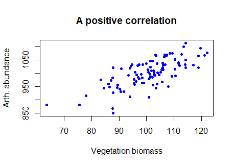
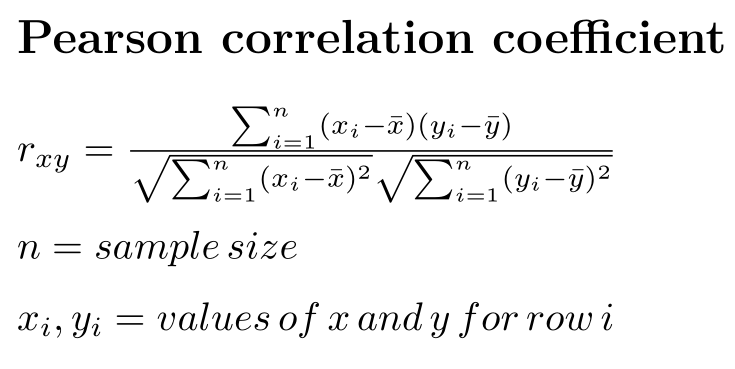

```{r setup, include=FALSE}
knitr::opts_chunk$set(echo = FALSE)
```

## Sampling and distributions


> Ice cream sales and forest fires are correlated because both occur more often in the summer heat.  But, **correlation does not imply causation**.

-Nate Silver

<center>

```{r, echo=FALSE, out.width="50%", fig.cap=""}
knitr::include_graphics("img/murmur.png")
```

</center>

## What you will learn

&nbsp;

-   The question of correlation
-   Data and assumptions
-   Graphing
-   Tests and alternatives
-   Practice exercises


## The question of correlation

&nbsp;

- Measure of **association**
- 2 (or more) **numeric variables**
- General correlation: a relationship
- Specific correlation: correlation coefficient


## The question of correlation

Graph a correlation with a scatterplot

<center>

```{r, echo=FALSE, out.width="70%", fig.cap=""}

```
</center>


## The question of correlation

Given some data:

<center>

```{r, echo=FALSE, out.width="70%", fig.cap=""}
knitr::include_graphics("img/cor-dat.png")
```
</center>


## The question of correlation

```{r, echo=FALSE}
veg <- c(101.7, 101.2, 97.1, 92.4, 91, 99.4, 104.2, 115.9, 91.9, 101.4, 
93.5, 87.2, 89.2, 92.8, 103.1, 116.4, 95.2, 80.9, 94.9, 88.8, 
108.2, 86.1, 104.1, 101.5, 116.9, 109.6, 103.7, 83.9, 85.9, 88.5, 
98.9, 98.8, 107.8, 86.5, 92.6, 76, 95.2, 105.3, 103.1, 89.3, 
100.1, 103.1, 87.7, 92.4, 91.5, 105.4, 105.7, 90.5, 105.6, 101.6, 
97.4, 93.4, 88.7, 81.1, 100.9, 91.6, 102.4, 92.8, 92, 97.1, 91.1, 
97.3, 104, 99, 101.5, 112.8, 82.4, 84.9, 116.3, 92.2, 106.2, 
94.2, 89.6, 108.8, 106.2, 91, 95.5, 99.1, 111.6, 124.1, 100.8, 
117.6, 118.6, 115.8, 102.2, 107.7, 105, 86.7, 99, 101.8, 106.3, 
100.3, 86.6, 106.4, 92.6, 108.2, 100.5, 100.9, 116.4)

arth <- c(1002, 1006, 930, 893, 963, 998, 1071, 1052, 997, 1044, 923, 
988, 1022, 975, 1022, 1050, 929, 928, 1019, 957, 1054, 850, 1084, 
995, 1065, 1039, 1009, 945, 995, 967, 916, 998, 988, 956, 975, 
910, 954, 1044, 1063, 948, 966, 1037, 976, 979, 969, 1009, 1076, 
943, 1024, 1071, 969, 963, 1020, 936, 1004, 961, 1089, 953, 1037, 
962, 977, 958, 944, 933, 970, 1036, 960, 912, 978, 967, 1035, 
959, 831, 1016, 901, 1010, 1072, 1019, 996, 1122, 1029, 1047, 
1132, 996, 979, 994, 970, 976, 997, 950, 1002, 1003, 982, 1071, 
959, 976, 1011, 1032, 1024)

```

```{r, echo = T, out.width = '80%', fig.cap=""}
plot(x = veg, y = arth,
     xlab = 'Vegetation biomass', ylab = 'Arth. abundance',
     main = 'A positive correlation',
     pch = 16, col = 'blue')
```


## Data and assumptions

The correlation coefficient is the **covariance** of 2 numeric variables divided by the product of their standard deviations

-1 < r < 1

<center>

```{r, echo=FALSE, out.width="80%", fig.cap=""}

```

</center>

## Data and assumptions

The correlation coefficient is the **covariance** of 2 numeric variables


```{r, echo=TRUE, out.width="80%", fig.cap=""}
# The 'hard' way
# (sample) covariance
cov_veg_arth <- sum( (veg-mean(veg))*(arth-mean(arth))) / 
                      (length(veg) - 1 )

# r
(r_arth_veg <- cov_veg_arth / (sd(veg) * sd(arth)))
```


## Data and assumptions

The correlation coefficient is the **covariance** of 2 numeric variables

Assumptions:

- linear relationship between variables

- Gaussian distribution for each variable


## Data and assumptions

The correlation coefficient is the **covariance** of 2 numeric variables


```{r, echo=TRUE, out.width="80%", fig.cap=""}
# The 'easy' way
cor(veg, arth)

```


## Graphing

A range of correlation magnitudes and signs

<center>
```{r, echo=FALSE, out.width="70%", fig.cap=""}
knitr::include_graphics("img/2.3-diff-r.png")

```

</center>

## Graphing

The `pairs()` function is useful for EDA


```{r, echo=T, out.width="60%", fig.cap=""}
data(iris)
# pairs plot
pairs(iris[ , 1:4], pch = 16, 
      col = iris$Species) # Set color to species...


```


## Tests and alternatives

&nbsp;

- Significance test (null: r == 0)
- **`cor.test()`** function
- **Pearson correlation** is traditional, with assumptions
- Alternative weaker test is the **Spearman Rank correlation** if assumptions are not met

## Tests and alternatives

```{r, echo = T}
cor.test(veg, arth)
```

## Tests and alternatives

&nbsp;

Reporting results (NEVER PASTE RAW OUTPUT)

> We found a significant correlation between vegetation biomass and arthropod abundance (Pearson’s r = 0.61, df = 97, P < 0.0001)


## Live coding


<center>

```{r, echo=FALSE, out.width="80%", fig.cap=""}
knitr::include_graphics("img/cat-laptop.jfif")
```

</center>
