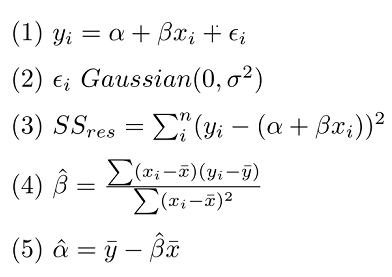
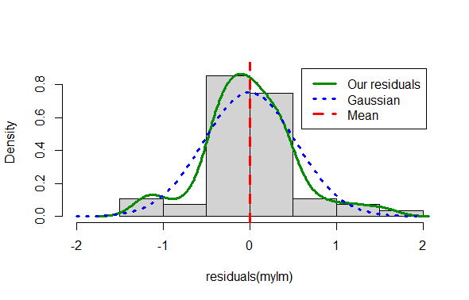

```{r setup, include=FALSE}
knitr::opts_chunk$set(echo = FALSE)
```

## Regression


> Whenever the correlation between two scores is imperfect, there will be regression to the mean.

-Francis Galton

<center>

```{r, echo=FALSE, out.width="50%", fig.cap=""}

```

</center>

## Regression

&nbsp;

**Linear regression** is a foundational tool for scientists

- Used to quantify causation

- Specific numerical predictions

- Foundation for other linear models...


## What you will learn

&nbsp;

- The question of simple linear regression
- Data and assumptions
- Graphing
- Tests and alternatives
- Practice exercises

## The question of simple linear regression

&nbsp;

"Does X explain significant variation in Y"

The main question we tend to ask is whether the slope of the regression is different than zero

$Y = \alpha + \beta X + \epsilon$

## Data and assumptions

Formal assumptions 

<center>

```{r, echo=FALSE, out.width="50%", fig.cap=""}

```

</center>

## Data and assumptions

Informal assumptions (the ones we have responsibility to evaluate)

- (Relationship is linear)

- (Numeric continuous data)

- The residuals are "Gaussian"

- Homoscedasticity

- Independence of observations


## Data and assumptions

**Kaggle Fish market data**

**Species**, character, fish spp 

**Weight**, numeric, weight in grams

**Length1**, numeric, vertical length in cm

**Length2**, numeric, diagonal length in cm

**Length3**, numeric, cross length in cm

**Height**, numeric, height in cm

**Width**, numeric, diagonal width in cm

https://www.kaggle.com/aungpyaeap/fish-market

## Data and assumptions

```{r, echo=T}
library(openxlsx)
dat <- read.xlsx('data/2.4-fish.xlsx')
head(dat)

```

## Data and assumptions

Slice out perch

```{r, echo=T}
dat$Species == 'Perch'

```
## Data and assumptions

Slice out perch

```{r, echo=T}
perch <- dat[dat$Species == "Perch" , ]
head(perch)
```

## Graphing regression

```{r, echo=T, out.width = '65%'}
# literally the least you can do
plot(y = perch$Height, x = perch$Width)
lm0_perch <- lm(Height ~ Width, data = perch)
abline(lm0_perch)
```

## Graphing regression

```{r, echo=T, out.width = '65%'}
plot(y = perch$Height, x = perch$Width,
     ylab = "Height (cm)", xlab = "Width (cm)",
     main = "My perch regression plot",
     pch = 20, col = "blue", cex = 1)

abline(lm0_perch)

```

## Graphing regression

Residuals Gaussian?

```{r, echo = T, out.width = '65%'}
hist(residuals(lm0_perch))
```

## Graphing regression

Residuals Gaussian?

```{r, echo = T, out.width = '65%'}
plot(x = lm0_perch, which = 1)
```

## Graphing regression


<center>

```{r, echo=F, out.width = '85%'}

```
</center>

## Graphing regression

Sometimes a statistical test may be used to diagnose the distribution

```{r, echo = T}
shapiro.test(residuals(lm0_perch))
```

## Graphing regression

We found no evidence the residuals deviated from the Gaussian expectation (Shapiro-Wilk: W = 0.97, n = 56, P = 0.14)

Is this the same as evidence the residuals "are Gaussian"? (no)


## Tests and alternatives

```{r, echo = F}
summary(lm0_perch)
```

## Tests and alternatives

Let's report this:

$length = 0.30 + 1.59*width$

**We found a significant linear relationship for Height predicting Weight in perch (regression: R-squared = 0.97, df = 1,54, P < 0.0001)**

NB this is a test of whether the regression slope coefficient (1.59) is different to zero


## Live coding

<center>

```{r, echo=FALSE, out.width="80%", fig.cap=""}
knitr::include_graphics("img/cat-laptop.jfif")
```

</center>
