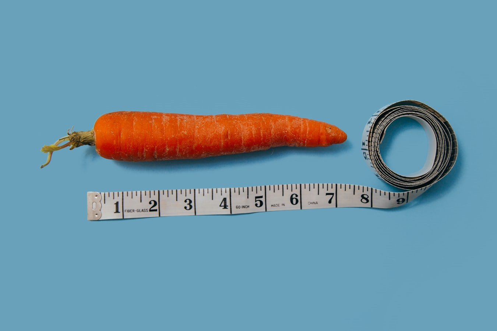

```{r setup, include=FALSE}
knitr::opts_chunk$set(echo = FALSE)
```

## Regression


> The t-test and t-distribution are widely considered to be at the very foundation of  statistics. Who would believe they were invented to make great beer better?

-The t-test invented by William Gosset ('Student'), Guiness Brewery

<center>

```{r, echo=FALSE, out.width="40%", fig.cap=""}

```

</center>

## T-test

&nbsp;

**The t-test** is a foundational tool for scientists

- Compare mean differences (2 sample) 

- 1-sample difference

- Paired sample differences...


## What you will learn

&nbsp;

- The question of the t-test
- Data and assumptions
- Graphing
- Tests and alternatives
- Practice exercises

## The question of the t-test

"2 sample test"

The main question is did these 2 samples come from populations with different means?

<center>

```{r, echo=FALSE, out.width="50%", fig.cap=""}

```

</center>


## The question of the t-test

"1 sample test"

The main question is did this 1 sample come from population of a known mean?

<center>

```{r, echo=FALSE, out.width="50%", fig.cap=""}

```

</center>


## The question of the t-test

"paired sample test"

Is there a consistent difference between paired sample observations?

<center>

```{r, echo=FALSE, out.width="50%", fig.cap=""}

```

</center>


## Data and assumptions

&nbsp;

Formal assumptions 

- Gaussian residuals (for EACH SAMPLE)

- Heteroscedasticity

- Independence of observations

## Data and assumptions

Informal assumptions (the ones we have responsibility to evaluate)

- Gaussian distribution (for EACH SAMPLE)

- Heteroscedasticity (in practice we account for this difference with math by using the  pooled SD)

- Independence of observations (if this is not true, perhaps paired samples is appropriate)


## Data and assumptions

&nbsp;

Example of mean human height by sex

<center>
```{r, out.width='90%'}

```

</center>

## Data and assumptions

Iris data

```{r, echo = T}
data(iris)
names(iris)
```

## Data and assumptions

```{r, echo=T, out.width = '60%'}
iris2 <- iris[1:100, c(1,5)]
iris2$Species <-droplevels(iris2$Species)
boxplot(Sepal.Length~Species, data = iris2)
stripchart(Sepal.Length~Species, data = iris2,
           pch = 16, col = 'red', vertical = T,
           add = T, method = 'jitter')

```

## Data and assumptions

```{r, echo=T, out.width = '60%'}
hist(iris2$Sepal.Length,
     main = 'wrong way to examine distribution')

```

## Data and assumptions

```{r, echo=T, out.width = '60%'}
par(mfrow = c(2,1))

hist(iris2$Sepal.Length[1:50], xlim = c(4,7), main = 'setosa')
hist(iris2$Sepal.Length[51:100], xlim = c(4,7), main = 'versicolor')

```

## Data and assumptions

&nbsp;

```{r, echo=T, out.width = '90%'}
par(mfrow = c(1,2))

qqnorm(iris2$Sepal.Length[1:50],
        main = "setosa")
qqline(iris2$Sepal.Length[1:50])
qqnorm(iris2$Sepal.Length[51:100],
        main = "versicolor")
qqline(iris2$Sepal.Length[51:100])

```


## Data and assumptions

Slice out perch


## Live coding

<center>

```{r, echo=FALSE, out.width="80%", fig.cap=""}
knitr::include_graphics("img/cat-laptop.jfif")
```

</center>
