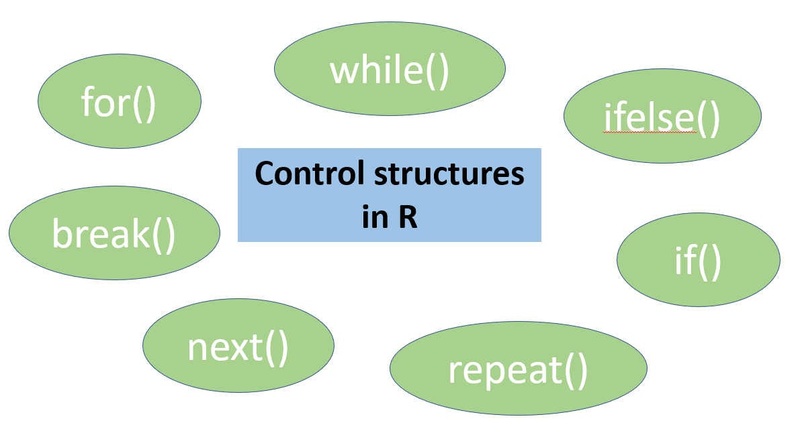
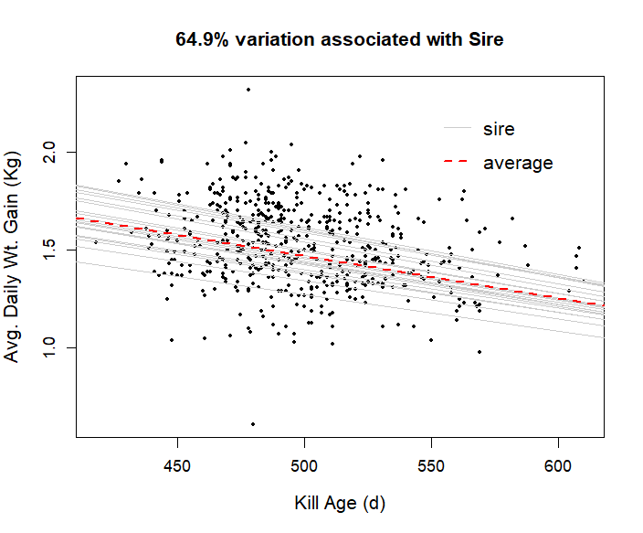

```{r setup, include=FALSE}
knitr::opts_chunk$set(echo = FALSE)
```

## Control structures


> Control structures allow you to set up conditions in a programming language, to 'automate the boring stuff'

<br>

<center>

```{r, echo=FALSE, out.width="70%", fig.cap=""}

```

</center>


## Outline

- for() loop in R

- while() conditions in R

- if(), else() and ifelse()

- for() example IRL

- problems


## for() loop in R

`for()` loops are used to repeat commands a certain number of times.

```r 
for(i in 1:10){
  
  <do this 10 times>

}
```

NB `i` is set to 1 and is incremented each cycle

NB2 `i` can be called anything (e.g. `bob` would work fine)

## for() loop in R

What will this print?

```r
for(bob in 1:25){
  print(paste("The number is", bob ))
}
```

<go to script>

## while() conditions in R

while() sets a condition and a command executes while the condition is true

```r
x = 1
  
# Print 1 to 5
while(x <= 5){
  print(x)
  x = x + 1  # condition increment
}
```

## if(), else() and ifelse()


`if()` executes a command if the condition is `TRUE`

`else()` is usually used with an initial `if()`, and executes if `TRUE`

```r
x <- 100
if(x > 10){
print(paste(x, "is greater than 10"))
}
```
```r
x <- 9
if(x > 10){
print(paste(x, "is greater than 10"))
} else{
print(paste(x, "is not greater than 10"))
}
```
## if(), else() and ifelse()

Same as previous example, different syntax

```r
x <- 9

ifelse(test = x > 10,
       yes = print(paste(x, "is greater than 10")),
       no = print(paste(x, "is not greater than 10")))

```

## for() example IRL

go to script...

<center>
```{r, echo=FALSE, out.width="70%", fig.cap=""}

```
</center>


## problem

```r
data <- data.frame(names=c('Tom', 'Bert', 'Anne'),
                   height = c(180, 188, 162),
                   country = c('England', 'Scotland', 'Wales'))
```
```
> data
  names height  country
1   Tom    180  England
2  Bert    188 Scotland
3  Anne    162    Wales
```

Use `write.csv()` to output each line to a csv file with the name of each file being the value of the 'names' vector(


