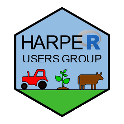
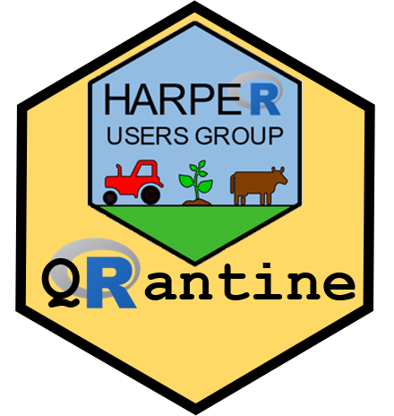
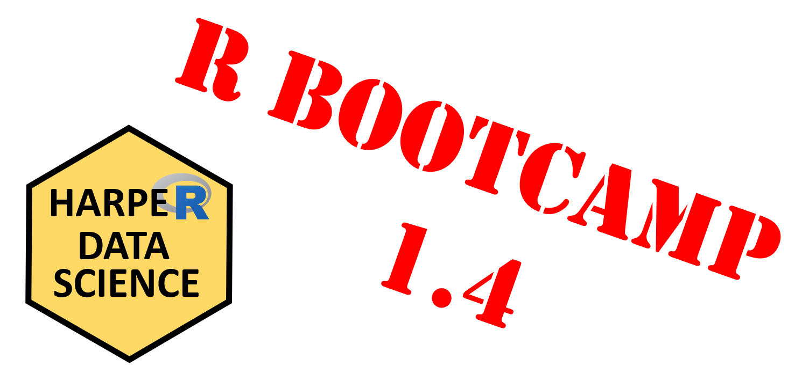
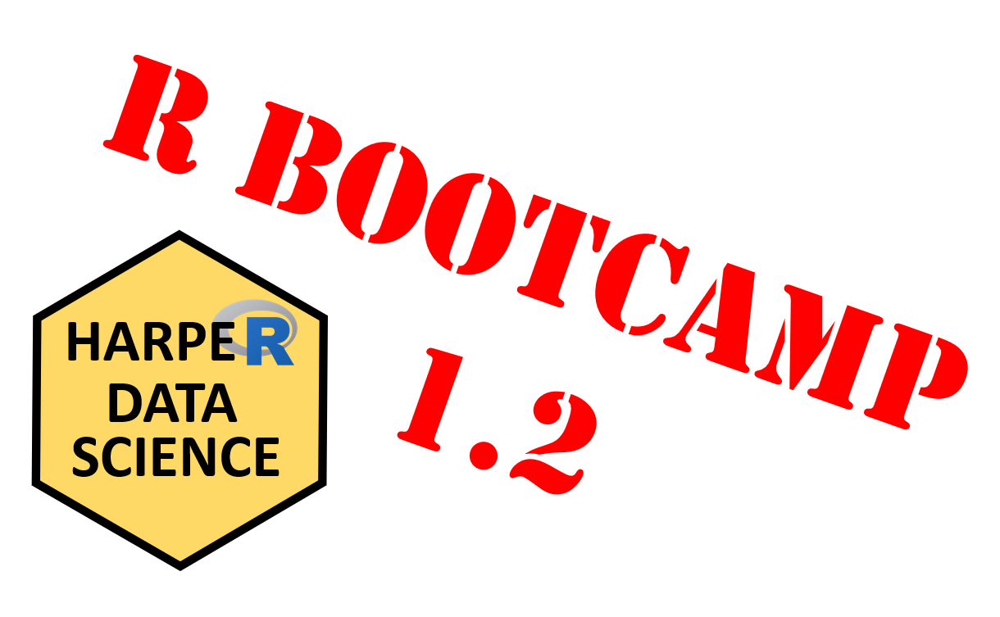

   
   

&nbsp;

**HARUG! is an R Users Group based at Harper Adams University.** We are a friendly group and welcome members from beginners to experts.  Our topics cover R programming and the practice of statistics, spanning skill building to live coding and problem solving, with occasional advanced topics or readings.

[HA Data Science main page](https://ha-data-science.github.io/)

&nbsp;

**Weekly live meetings Wednesdays at 4pm (online for now)**
  
[**Join us on Slack**](https://join.slack.com/t/harper-adams-rug/shared_invite/zt-azcm9z6s-WsY9JXvAs8DW1DLQuU3USg) (kindly register with your real name, e.g. "Ronald Fisher")

&nbsp;

___
  
 

**2021-10-13 bootcamp 2.2** (meeting #66) R Bootcamp 2.2 Distributions (Ed Harris) ::
[R Bootcamp 2.2 slides Rmd](harug-files/2021-10-13 bootcamp 2.2/R-bootcamp-2.2-slides.Rmd) ::
[R Bootcamp 2.2 slides HTML](harug-files/2021-10-13 bootcamp 2.2/R-bootcamp-2.2-slides.html) ::
[R Bootcamp webpage 2.2  Distributions](https://dsgarage.netlify.app/bootcamp/2.2-m2-sampling-and-distributions//) ::
[Script template](harug-files/files/script-template.R) ::
[Script bootcamp 2.2](harug-files/2021-10-13 bootcamp 2.2/script-bootcamp-2.2.R)

&nbsp;

 

**2021-10-06** (meeting #66) R Bootcamp 2.1 Question, Explore, Analyze (Ed Harris) ::
[R Bootcamp 2.1 slides Rmd](harug-files/2021-10-06 bootcamp 2.1/R-bootcamp-2.1-slides.Rmd) ::
[R Bootcamp 2.1 slides HTML](harug-files/2021-10-06 bootcamp 2.1/R-bootcamp-2.1-slides.html) ::
[R Bootcamp webpage 2.1  Data frames](https://dsgarage.netlify.app/bootcamp/2.1-m2-question-explore-analyze/) ::
[Script template](harug-files/files/script-template.R) ::
[Script bootcamp 2.1](harug-files/2021-10-06 bootcamp 2.1/script-bootcamp-2.1.R)

&nbsp;

 

**2021-08-11** (meeting #65) R Bootcamp 1.5 Data subsetting and manipulation (Ed Harris) ::
[R Bootcamp 1.5 slides Rmd](harug-files/2021-08-11/R-bootcamp-1.5-slides.Rmd) ::
[R Bootcamp 1.5 slides HTML](harug-files/2021-08-11/R-bootcamp-1.5-slides.html) ::
[R Bootcamp webpage 1.5  Data frames](https://dsgarage.netlify.app/bootcamp/1.5-m1-data-subsetting-and-manipulation/) ::
[Script template](harug-files/files/script-template.R) ::
[Script bootcamp 1.5](harug-files/2021-08-11/script-bootcamp-1.5.R)

&nbsp;

 

**2021-08-04** (meeting #64) R Bootcamp 1.4 Data frames in R (Ed Harris) ::
[R Bootcamp 1.4 slides Rmd](harug-files/2021-08-04/R-bootcamp-1.4-slides.Rmd) ::
[R Bootcamp 1.4 slides HTML](harug-files/2021-08-04/R-bootcamp-1.4-slides.html) ::
[R Bootcamp webpage 1.4 Data frames](https://dsgarage.netlify.app/bootcamp/1.4-m1-data-frames/) ::
[Script template](harug-files/files/script-template.R) ::
[Script bootcamp 1.4](harug-files/2021-08-04/script-bootcamp-1.4.R) ::
[Suggested reading: Tidy data concept](https://vita.had.co.nz/papers/tidy-data.pdf)

&nbsp;

 

**2021-07-28** (meeting #63) R Bootcamp 1.3 Data objects in R (Ed Harris) ::
[R Bootcamp 1.3 slides Rmd](harug-files/2021-07-28/R-bootcamp-1.3-slides.Rmd) ::
[R Bootcamp 1.3 slides HTML](harug-files/2021-07-28/R-bootcamp-1.3-slides.html) ::
[R Bootcamp webpage 1.3 Data objects in R](https://dsgarage.netlify.app/bootcamp/1.3-m1-data-objects/) :: 
[Script template](harug-files/files/script-template.R) ::
[Script bootcamp 1.3](harug-files/2021-07-28/script-bootcamp-1.3.R) 

&nbsp;

 

**2021-07-21** (meeting #62) R Bootcamp 1.2 Functions and packages (Ed Harris) ::
[R Bootcamp 1.2 slides Rmd](harug-files/2021-07-21/R-bootcamp-1.2-slides.Rmd) ::
[R Bootcamp 1.2 slides HTML](harug-files/2021-07-21/R-bootcamp-1.2-slides.html) ::
[R Bootcamp webpage 1.2 Functions and packages](https://dsgarage.netlify.app/bootcamp/1.2-m1-function-and-packages/) ::
[Script template](harug-files/files/script-template.R) ::
[Script bootcamp 1.2](harug-files/2021-07-21/script-bootcamp-1.2.R) ::
[Suggested reading: Helping yourself in R](https://www.r-project.org/help.html)

&nbsp;

 

**2021-07-14** (meeting #61) R Bootcamp 1.1 Syntax basics (Ed Harris) ::
[R Bootcamp 1.1 slides Rmd](harug-files/2021-07-14/R-bootcamp-1.1.Rmd) :: 
[R Bootcamp 1.1 slides HTML](harug-files/2021-07-14/R-bootcamp-1.1.html) :: 
[R Bootcamp webpage 1.1 Syntax basics](https://dsgarage.netlify.app/bootcamp/1.1-m1-r-syntax-basics/) ::
[Script template](harug-files/files/script-template.R) ::
[Script bootcamp 1.1](harug-files/2021-07-14/script-bootcamp-1.1.R) ::
[Suggested reading: Tidyverse skeptic](https://github.com/matloff/TidyverseSkeptic)

&nbsp;

 

**2021-07-07** (meeting #60) R Bootcamp Launch and software setup (Ed Harris) ::
[R Bootcamp launch slides Rmd](harug-files/2021-07-07/R-bootcamp-launch-slides.Rmd) ::
[R Bootcamp launch slides HTML](harug-files/2021-07-07/R-bootcamp-launch-slides.html) :: 
[R Bootcamp Rstudio slides Rmd](harug-files/2021-07-07/R-bootcamp-RStudio.Rmd) ::
[R Bootcamp Rstudio slides HTML](harug-files/2021-07-07/R-bootcamp-RStudio.html) ::
[R Bootcamp webpage 0.0 Overview](https://dsgarage.netlify.app/bootcamp/0.0-bootcamp-overview/) ::
[R Bootcamp webpage 0.1 Introduction](https://dsgarage.netlify.app/bootcamp/0.1-bootcamp-intro/) :: 
[Script template](harug-files/files/script-template.R)

&nbsp;

 

**2021-06-30** (meeting #59) R markdown Github webpage (Ed Harris) ::
[Github webpage slides ppt](harug-files/2021-06-30/2021-06-30-github-webpage.pptx) ::
[Template files zip](harug-files/2021-06-30/webpage files.zip) 

___

&nbsp;

**2019-2021** Previous meetings (not all are indexed) [HARUG! on Operorgenetic](http://operorgenetic.com/wp/) (files from previous meetings may be migrated here at some point)

&nbsp;

