

   

&nbsp;

**HARUG! is an R Users Group based at Harper Adams University.** We are a friendly group and welcome members from beginners to experts.  Our topics cover R programming and the practice of statistics, spanning skill building to live coding and problem solving, with occasional advanced topics or readings.

[HA Data Science main page](https://ha-data-science.github.io/)

&nbsp;

**Weekly live meetings Wednesdays at 4pm (online for now)**
  
[**Join us on Slack**](https://join.slack.com/t/harper-adams-rug/shared_invite/zt-azcm9z6s-WsY9JXvAs8DW1DLQuU3USg) (kindly register with your real name, e.g. "Ronald Fisher")

&nbsp;

---

Future:

> `Spring break for a few weeks...`

On deck for when we resume:

Visualising non-linear regression in R with {ggplot2} (German (Agustin) Fernandez)

---

&nbsp;

 
[[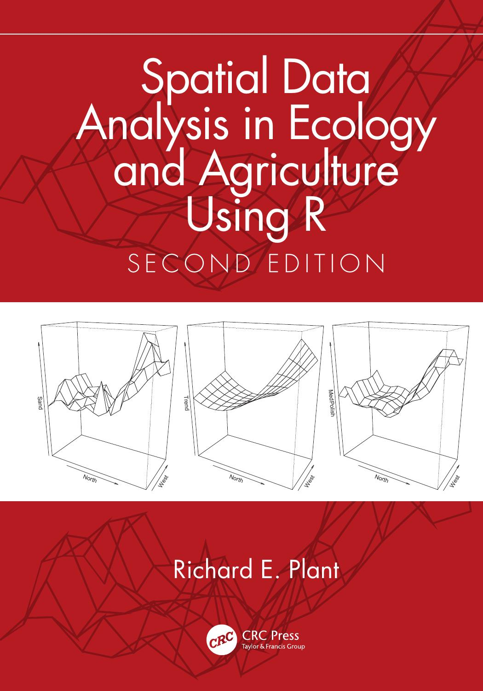]](harug-files/2022-04-27-spatial-01-02/img/cover.png) 

**2022-05-11 (meeting #93) Presentation of overview and solutions Ch 04 Plant 2018 (Fynn)** 

[Reading ch04](https://github.com/weharris/C7046-activity/raw/main/material/04-ch04.pdf)

[slides]() :: [script]() :: [data]()

&nbsp;

<a href="https://youtu.be/YD_KCqGqo1g" target="_blank">
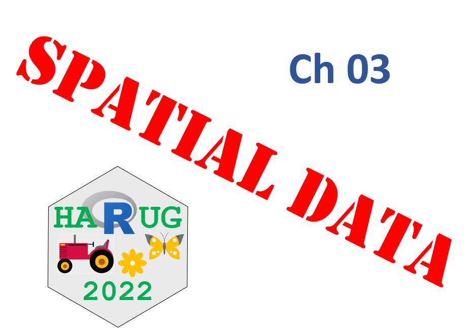
</a> 
[[]](harug-files/2022-04-27-spatial-01-02/img/cover.png) 

**2022-05-04 (meeting #92) Presentation of overview and solutions Ch 03 Plant 2018 (German)** 

[Reading ch03](https://github.com/weharris/C7046-activity/raw/main/material/03-ch03.pdf)

[slides](harug-files/2022-05-04-spatial-03/Statistical Properties of Spatially Autocorrelated Data Ch 3.pptx) :: [Ed's live code from German's presentation](harug-files/2022-05-04-spatial-03/script.R) :: [excel data from chat](harug-files/2022-05-04-spatial-03/Data 2022 V 04.xlsx)

&nbsp;

<a href="" target="_blank">
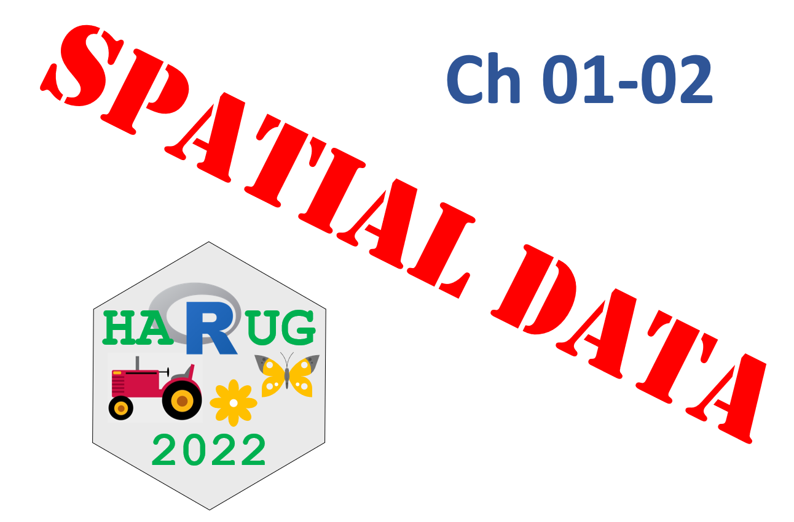
</a> 
[[]](harug-files/2022-04-27-spatial-01-02/img/cover.png) 
[video part 1](https://youtu.be/wl_502CvdCI) :: [video part 2](https://youtu.be/ge3OVG45KLQ)

**2022-04-27 (meeting #91) Read and go through Ch 01-02 of Plant, R.E., 2018. Spatial Data Analysis in Ecology and Agriculture Using R (Ed)** 

[Reading ch01](https://github.com/weharris/C7046-activity/raw/main/material/01-ch01.pdf) ::
[Reading ch02](https://github.com/weharris/C7046-activity/raw/main/material/02-ch02.pdf)

[slides HTML](harug-files/2022-04-27-spatial-01-02/2022-04-27-slides.html) :: [slides Rmd](harug-files/2022-04-27-spatial-01-02/2022-04-27-slides.Rmd) :: [chapter and exercises code](harug-files/2022-04-27-spatial-01-02/Ch02-code.R) :: [data .zip](harug-files/2022-04-27-spatial-01-02/data.zip)

&nbsp;

<a href="https://youtu.be/euW_EyzsZzE" target="_blank">
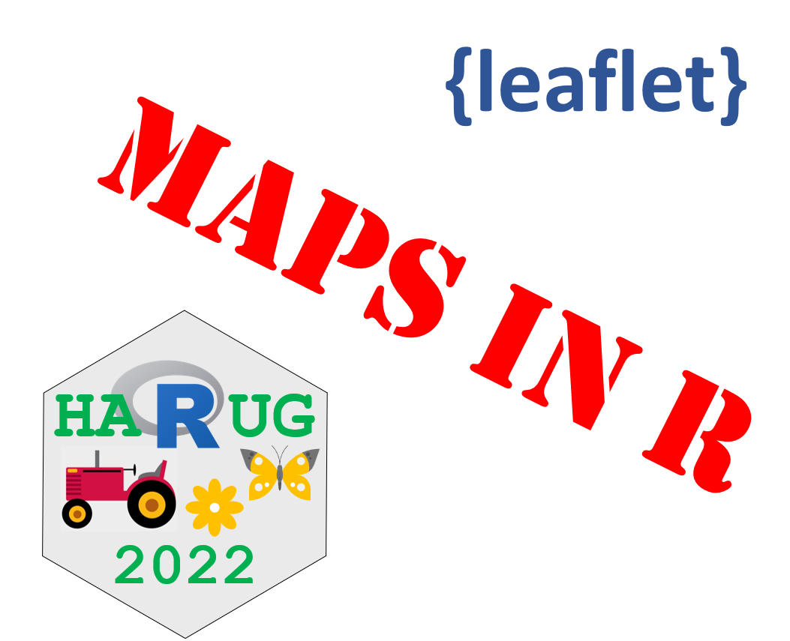
</a> 

**2022-04-20 (meeting #90) Simple spatial maps and visualisation of spatial data in Shiny: example with Harper Adams biodiversity data + eBird (Ed)** 

[leaflet script](harug-files/2022-04-20/HAU-biodiversity.R)

&nbsp;

<a href="https://youtu.be/Mkws8qxS0d8" target="_blank">
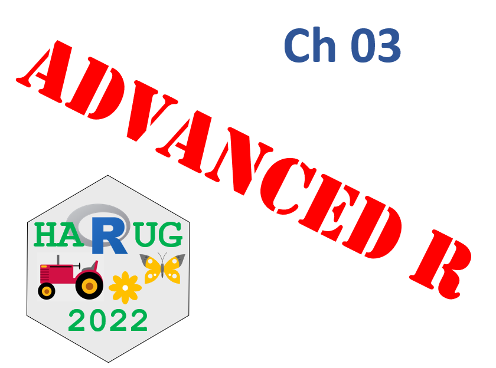
</a> 
[[]](harug-files/2022-04-13-AdvR-03/img/tribble.png)

**2022-04-13 (meeting #89) Reading and activity from 'Advanced R' Ch 03 (George Wager)** 

[pptx slides](harug-files/2022-04-13-AdvR-03/HARUG-CH03.pptx) :: [Chapter 03 reading](https://adv-r.hadley.nz/vectors-chap.html)

&nbsp;

<a href="https://youtu.be/hqFoLW48bf8" target="_blank">
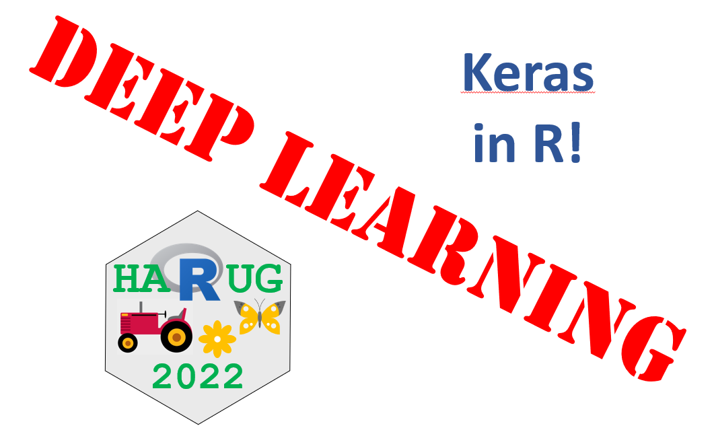
</a>

**2022-04-06 (meeting #88) Using Keras for classification on soil data (Przemek Dolowy)** 

[pptx slides](harug-files/2022-04-06-keras/przemek-slides.pptx) 

&nbsp;

**2022-03-30 (meeting #87) Twitter scraper in R (Joe Roberts)** 

[Joe's weather bot](https://github.com/Dr-Joe-Roberts/weather_bot) 

&nbsp;

<a href="https://youtu.be/WRqCDGKIbEw" target="_blank">
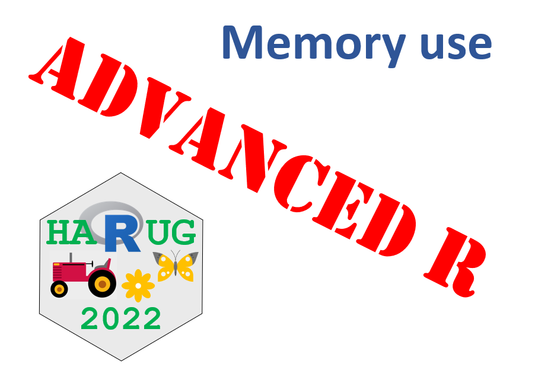
</a>

**2022-03-23 (meeting #86) Reading and activity from ['Advanced R' Ch 02](https://adv-r.hadley.nz/names-values.html) (George Wager)** 

[pptx slides](harug-files/2022-03-23-AdvR-02/HARUG-CH02.pptx) :: [quiz code](harug-files/2022-03-23-AdvR-02/QUIZ_TEMPLATE.R) :: [Chapter 02 reading](https://adv-r.hadley.nz/names-values.html)

&nbsp;

<a href="https://youtu.be/djc-U2FzeeQ" target="_blank">
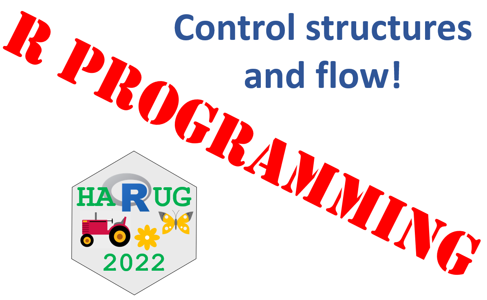
</a>

**2022-03-16 (meeting #85) (by request) Small R topics, like for() loops, ifelse(), setting up an R project directory and script (Ed)** 

[slides](harug-files/2022-03-16-ed-for-loop/2022-03-16-slides.html) :: [code](harug-files/2022-03-16-ed-for-loop/for.R) :: [slides-code](harug-files/2022-03-16-ed-for-loop/2022-03-16-slides.Rmd)

&nbsp;

**2022-03-09 (meeting #84) Python computer vision: Yolov5, What is it good For!? (George Wager)** 

[George's Github Repo](https://github.com/georginaanna/Implementing-YOLOv5)

&nbsp;

<a href="https://youtu.be/1vLaVIbuSk4" target="_blank">
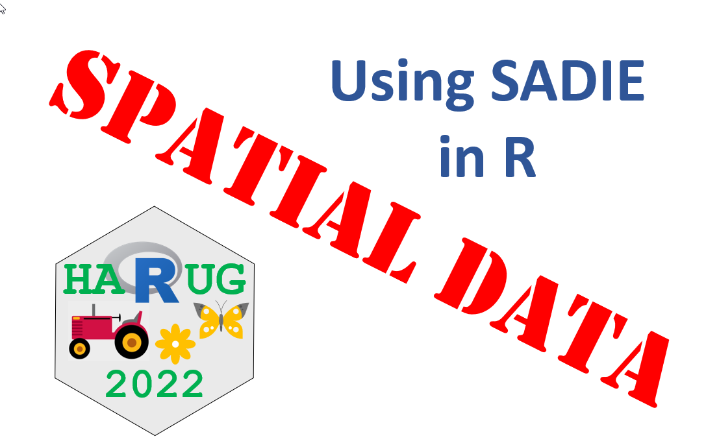
</a>

**2022-03-02 (meeting #83) Modelling spatial occurrence with SADIE in R (Peter Ngimbwa)** 

[{epiphy} package vignette](https://cran.r-project.org/web/packages/epiphy/vignettes/epiphy.html) :: [Article 20 years of SADIE](https://rethinkingecology.pensoft.net/article/30890/) :: [Article spatial patterns](https://besjournals.onlinelibrary.wiley.com/doi/full/10.1111/j.2041-210X.2011.00165.x)

&nbsp;

<a href="" target="_blank">
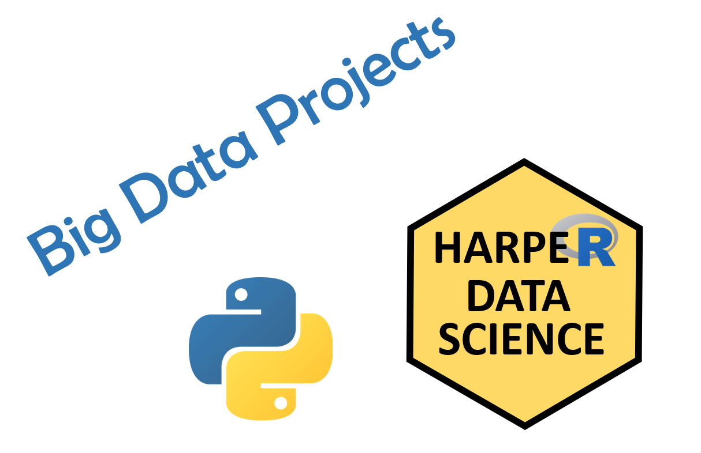
</a> No video for this week

**2022-02-23 (meeting #82) Big Data project pitches (Sophie and Harry)** 

&nbsp;

**2022-02-16 (meeting #81) (Iona's suggestion) automating file downloads for data harvesting from the web (Ed Harris)** :: [script](harug-files/2022-02-16-scrape/scraping.R) :: [example data](harug-files/2022-02-16-scrape/data/StatementSummaries2022.csv)

&nbsp;

<a href="https://youtu.be/io1cnc-BWNk" target="_blank">
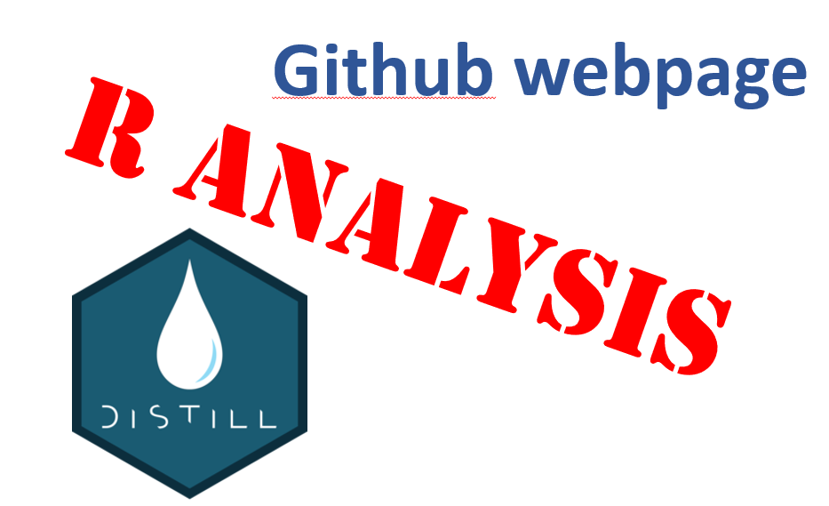
</a>

**2022-02-02 (meeting #80) Making a website with the {distill} package, R Markdown and Hugo (Joe Roberts)** :: [Joe's example code zip](harug-files/2022-02-02-distill/harug_website_demo.zip)

&nbsp;

**2022-01-26 (meeting #79) R for best practice for non-R users** (Ed Harris) :: [Slides](harug-files/2022-01-26-reprex/reprex-slides.html) :: 
[Slides script](harug-files/2022-01-26-reprex/reprex-slides.Rmd) :: [Example script](harug-files/2022-01-26-reprex/reprex-code.R)

&nbsp;

<a href="" target="_blank">
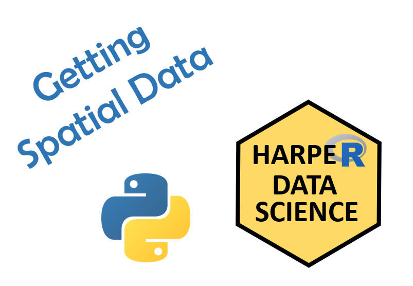
</a> No video for this week

**2022-01-19 (meeting #78) R + Python Scraping API for spatial data ** (Matt Butler) ::  :: 
 :: 

&nbsp;

 No video for this week

**2022-01-12 (meeting #77) Reproducible statistical report in R Markdown** (George Wager) :: [George reproducible Rmd](harug-files/2022-01-12-Rmd/zerostyle.Rmd) :: [George zerostyle Rmd](harug-files/2022-01-12-Rmd/reproducible_rmarkdownv01.Rmd) :: [Ed example .Rmd for stats report](harug-files/2022-01-12-Rmd/alistair.Rmd) :: 
[Ed example data](harug-files/2022-01-12-Rmd/Alistair-data-ed.xlsx) :: [Ed example .pdf output](harug-files/2022-01-12-Rmd/alistair.pdf)

&nbsp;

<a href="https://youtu.be/fpJ3IEoSLQE" target="_blank">
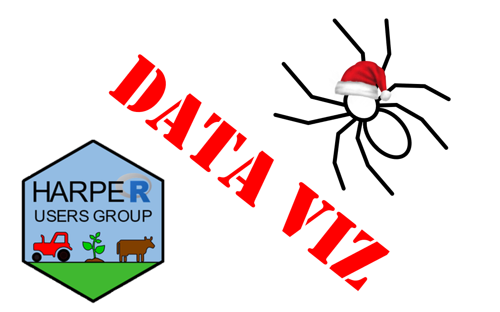
</a> 

**2021-12-15  (meeting #76) Last meeting of 2021. R/Python Christmas card data viz activity** (Ed Harris/everyone) :: [Tidy Tuesday Github Repository spiders data](https://github.com/rfordatascience/tidytuesday/tree/master/data/2021/2021-12-07) :: 
[Tidy Tuesday script](harug-files/2021-12-15-data-viz/data.viz.R) 

&nbsp;

<a href="https://youtu.be/YtARlZysA9w" target="_blank">
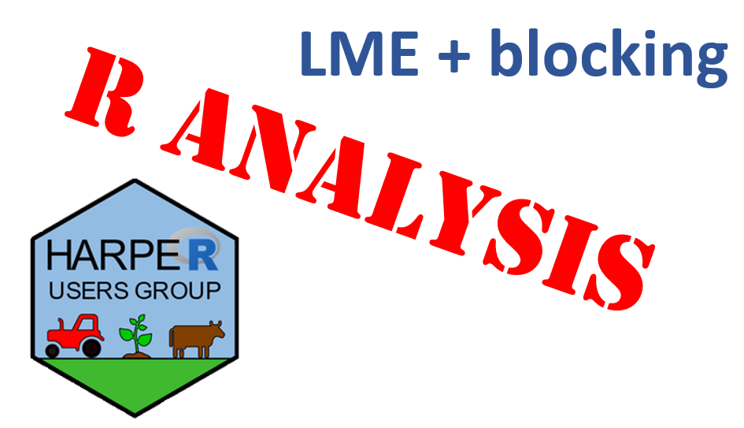
</a> 

**2021-12-08 (meeting #75) R Primer on mixed effects models and blocking** (Ed Harris) ::
[LME + Blocking ppt](harug-files/2021-12-08-LME/2021-12-08-LME.pptx) ::
[LME + Blocking script and data zip](harug-files/2021-12-08-LME/2021-12-08-LME.zip) 

&nbsp;

 

**2021-12-01 NLP sentiment analysis** (meeting #74) Python NLP sentiment analysis (Ed Harris) :: Colab tutorial basic Sentiment Analysis =    :: [NLP Going Farther (zip with more iPython notebooks...)](harug-files/2021-12-01-NLP-sentiment-analysis/chapter11_going_farther.zip)

&nbsp;

<a href="https://youtu.be/GnCsywQvycU" target="_blank">
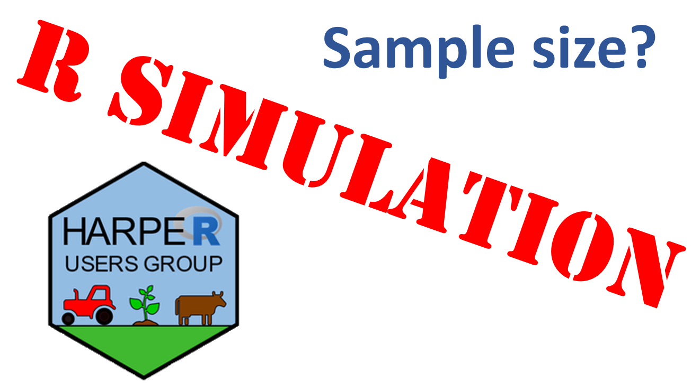
</a> 

**2021-11-24 R sample size simulation** (meeting #73) R sample size simulation (Przemek Dolowy) ::
[R sample size simulation ppt](harug-files/2021-11-24-R-sample-size-sim/Poisson for HARUG.pptx) ::
[R sample size simulation files](harug-files/2021-11-24-R-sample-size-sim/R-sample-size-sim.zip) 

&nbsp;

<a href="https://youtu.be/BS9Ts8QVKww" target="_blank">
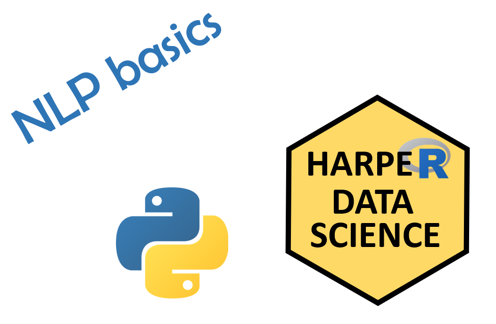
</a> 

**2021-11-17 NLP basics** (meeting #72) Python NLP Basics (Ed Harris) ::
[NLP basics files zip](harug-files/2021-11-17-NLP-basics/hap-e-nlp.zip)

&nbsp;

<a href="https://youtu.be/e0B5tXfPAgM" target="_blank">
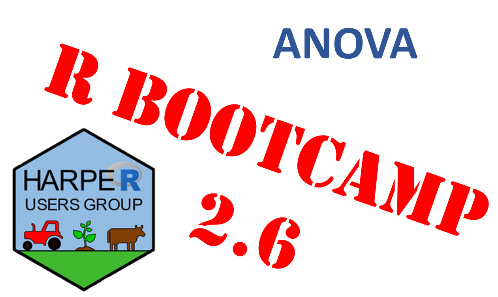
</a> 

**2021-11-10 bootcamp 2.6** (meeting #71) R Bootcamp 2.6 1-way ANOVA (Ed Harris) ::
[R Bootcamp webpage 2.6 Regression](https://dsgarage.netlify.app/bootcamp/2.6-1-way-anova/) ::
[Script template](harug-files/files/script-template.R)

&nbsp;

<a href="https://youtu.be/Bt2f902F5Po" target="_blank">
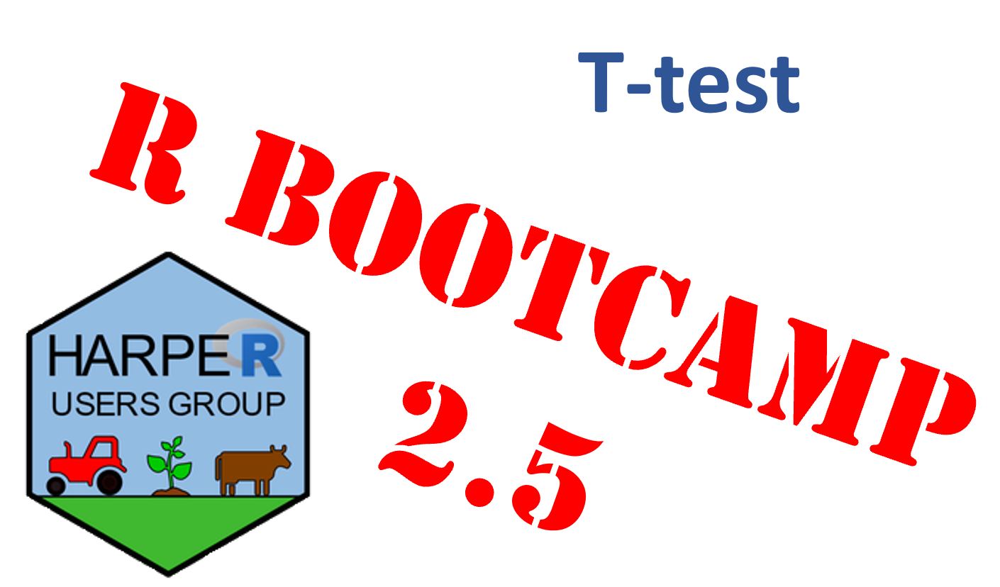
</a> 

**2021-11-03 bootcamp 2.5** (meeting #70) R Bootcamp 2.5 T-test (Ed Harris) ::
[R Bootcamp 2.5 slides Rmd](harug-files/2021-11-03-bootcamp-2.5/R-bootcamp-2.5-slides.Rmd) ::
[R Bootcamp 2.5 slides HTML](harug-files/2021-11-03-bootcamp-2.5/R-bootcamp-2.5-slides.html) ::
[R Bootcamp webpage 2.5 Regression](https://dsgarage.netlify.app/bootcamp/2.5-m2-t-test/) ::
[Script template](harug-files/files/script-template.R) ::
[Script bootcamp 2.5](harug-files/2021-11-03-bootcamp-2.5/script-bootcamp-2.5.R)

&nbsp;

<a href="https://youtu.be/Eaao5s6EupI" target="_blank">
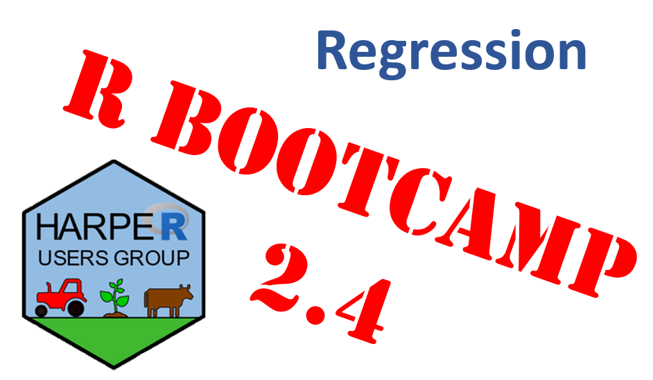
</a> 

**2021-10-27 bootcamp 2.4** (meeting #69) R Bootcamp 2.4 Simple linear regression (Ed Harris) ::
[R Bootcamp 2.4 slides Rmd](harug-files/2021-10-27-bootcamp-2.4/R-bootcamp-2.4-slides.Rmd) ::
[R Bootcamp 2.4 slides HTML](harug-files/2021-10-27-bootcamp-2.4/R-bootcamp-2.4-slides.html) ::
[R Bootcamp webpage 2.4 Regression](https://dsgarage.netlify.app/bootcamp/2.4-m2-correlation/) ::
[Script template](harug-files/files/script-template.R) ::
[Script bootcamp 2.4](harug-files/2021-10-27-bootcamp-2.4/script-bootcamp-2.4.R)

&nbsp;

<a href="https://youtu.be/wfTlkLSeV9g" target="_blank">
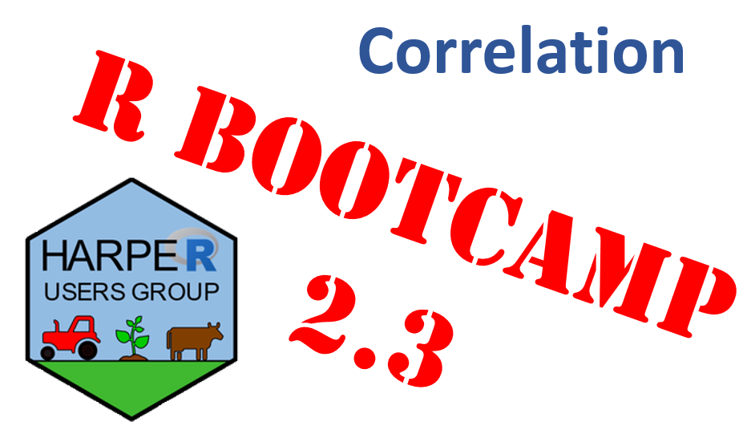
</a> 

**2021-10-20 bootcamp 2.3** (meeting #68) R Bootcamp 2.3 Distributions (Ed Harris) ::
[R Bootcamp 2.3 slides Rmd](harug-files/2021-10-20-bootcamp-2.3/R-bootcamp-2.3-slides.Rmd) ::
[R Bootcamp 2.3 slides HTML](harug-files/2021-10-20-bootcamp-2.3/R-bootcamp-2.3-slides.html) ::
[R Bootcamp webpage 2.3  Correlation](https://dsgarage.netlify.app/bootcamp/2.3-m2-correlation/) ::
[Script template](harug-files/files/script-template.R) ::
[Script bootcamp 2.3](harug-files/2021-10-20-bootcamp-2.3/script-bootcamp-2.3.R)

&nbsp;

<a href="https://youtu.be/MYin2LRQ6wk" target="_blank">
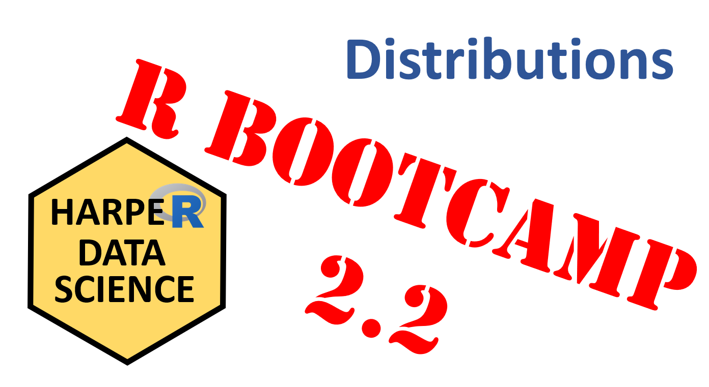
</a> 

**2021-10-13 bootcamp 2.2** (meeting #67) R Bootcamp 2.2 Distributions (Ed Harris) ::
[R Bootcamp 2.2 slides Rmd](harug-files/2021-10-13-bootcamp-2.2/R-bootcamp-2.2-slides.Rmd) ::
[R Bootcamp 2.2 slides HTML](harug-files/2021-10-13-bootcamp-2.2/R-bootcamp-2.2-slides.html) ::
[R Bootcamp webpage 2.2  Distributions](https://dsgarage.netlify.app/bootcamp/2.2-m2-sampling-and-distributions//) ::
[Script template](harug-files/files/script-template.R) ::
[Script bootcamp 2.2](harug-files/2021-10-13-bootcamp-2.2/script-bootcamp-2.2.R)

&nbsp;

<a href="https://youtu.be/5jWZTQfUFqQ" target="_blank">
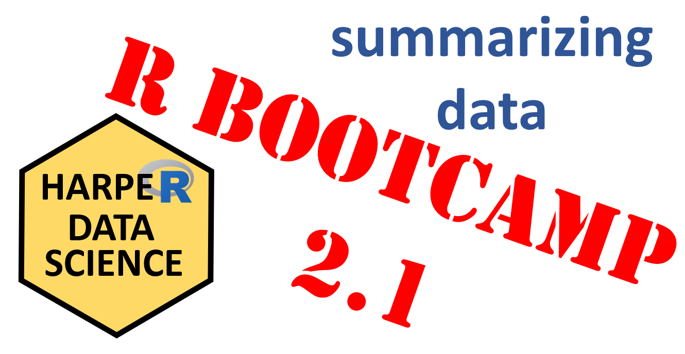
</a> 

**2021-10-06** (meeting #66) R Bootcamp 2.1 Question, Explore, Analyze (Ed Harris) ::
[R Bootcamp 2.1 slides Rmd](harug-files/2021-10-06-bootcamp-2.1/R-bootcamp-2.1-slides.Rmd) ::
[R Bootcamp 2.1 slides HTML](harug-files/2021-10-06-bootcamp-2.1/R-bootcamp-2.1-slides.html) ::
[R Bootcamp webpage 2.1  Data frames](https://dsgarage.netlify.app/bootcamp/2.1-m2-question-explore-analyze/) ::
[Script template](harug-files/files/script-template.R) ::
[Script bootcamp 2.1](harug-files/2021-10-06-bootcamp-2.1/script-bootcamp-2.1.R)

&nbsp;

 

**2021-08-11** (meeting #65) R Bootcamp 1.5 Data subsetting and manipulation (Ed Harris) ::
[R Bootcamp 1.5 slides Rmd](harug-files/2021-08-11/R-bootcamp-1.5-slides.Rmd) ::
[R Bootcamp 1.5 slides HTML](harug-files/2021-08-11/R-bootcamp-1.5-slides.html) ::
[R Bootcamp webpage 1.5  Data frames](https://dsgarage.netlify.app/bootcamp/1.5-m1-data-subsetting-and-manipulation/) ::
[Script template](harug-files/files/script-template.R) ::
[Script bootcamp 1.5](harug-files/2021-08-11/script-bootcamp-1.5.R)

&nbsp;

 

**2021-08-04** (meeting #64) R Bootcamp 1.4 Data frames in R (Ed Harris) ::
[R Bootcamp 1.4 slides Rmd](harug-files/2021-08-04/R-bootcamp-1.4-slides.Rmd) ::
[R Bootcamp 1.4 slides HTML](harug-files/2021-08-04/R-bootcamp-1.4-slides.html) ::
[R Bootcamp webpage 1.4 Data frames](https://dsgarage.netlify.app/bootcamp/1.4-m1-data-frames/) ::
[Script template](harug-files/files/script-template.R) ::
[Script bootcamp 1.4](harug-files/2021-08-04/script-bootcamp-1.4.R) ::
[Suggested reading: Tidy data concept](https://vita.had.co.nz/papers/tidy-data.pdf)

&nbsp;

 

**2021-07-28** (meeting #63) R Bootcamp 1.3 Data objects in R (Ed Harris) ::
[R Bootcamp 1.3 slides Rmd](harug-files/2021-07-28/R-bootcamp-1.3-slides.Rmd) ::
[R Bootcamp 1.3 slides HTML](harug-files/2021-07-28/R-bootcamp-1.3-slides.html) ::
[R Bootcamp webpage 1.3 Data objects in R](https://dsgarage.netlify.app/bootcamp/1.3-m1-data-objects/) :: 
[Script template](harug-files/files/script-template.R) ::
[Script bootcamp 1.3](harug-files/2021-07-28/script-bootcamp-1.3.R) 

&nbsp;

 

**2021-07-21** (meeting #62) R Bootcamp 1.2 Functions and packages (Ed Harris) ::
[R Bootcamp 1.2 slides Rmd](harug-files/2021-07-21/R-bootcamp-1.2-slides.Rmd) ::
[R Bootcamp 1.2 slides HTML](harug-files/2021-07-21/R-bootcamp-1.2-slides.html) ::
[R Bootcamp webpage 1.2 Functions and packages](https://dsgarage.netlify.app/bootcamp/1.2-m1-function-and-packages/) ::
[Script template](harug-files/files/script-template.R) ::
[Script bootcamp 1.2](harug-files/2021-07-21/script-bootcamp-1.2.R) ::
[Suggested reading: Helping yourself in R](https://www.r-project.org/help.html)

&nbsp;

 

**2021-07-14** (meeting #61) R Bootcamp 1.1 Syntax basics (Ed Harris) ::
[R Bootcamp 1.1 slides Rmd](harug-files/2021-07-14/R-bootcamp-1.1.Rmd) :: 
[R Bootcamp 1.1 slides HTML](harug-files/2021-07-14/R-bootcamp-1.1.html) :: 
[R Bootcamp webpage 1.1 Syntax basics](https://dsgarage.netlify.app/bootcamp/1.1-m1-r-syntax-basics/) ::
[Script template](harug-files/files/script-template.R) ::
[Script bootcamp 1.1](harug-files/2021-07-14/script-bootcamp-1.1.R) ::
[Suggested reading: Tidyverse skeptic](https://github.com/matloff/TidyverseSkeptic)

&nbsp;

 

**2021-07-07** (meeting #60) R Bootcamp Launch and software setup (Ed Harris) ::
[R Bootcamp launch slides Rmd](harug-files/2021-07-07/R-bootcamp-launch-slides.Rmd) ::
[R Bootcamp launch slides HTML](harug-files/2021-07-07/R-bootcamp-launch-slides.html) :: 
[R Bootcamp Rstudio slides Rmd](harug-files/2021-07-07/R-bootcamp-RStudio.Rmd) ::
[R Bootcamp Rstudio slides HTML](harug-files/2021-07-07/R-bootcamp-RStudio.html) ::
[R Bootcamp webpage 0.0 Overview](https://dsgarage.netlify.app/bootcamp/0.0-bootcamp-overview/) ::
[R Bootcamp webpage 0.1 Introduction](https://dsgarage.netlify.app/bootcamp/0.1-bootcamp-intro/) :: 
[Script template](harug-files/files/script-template.R)

&nbsp;

 

**2021-06-30** (meeting #59) R markdown Github webpage (Ed Harris) ::
[Github webpage slides ppt](harug-files/2021-06-30/2021-06-30-github-webpage.pptx) ::
[Template files zip](harug-files/2021-06-30/webpage files.zip) 

___

&nbsp;

**2019-2021** Previous meetings (not all are indexed) [HARUG! on Operorgenetic](http://operorgenetic.com/wp/) (files from previous meetings may be migrated here at some point)

&nbsp;

